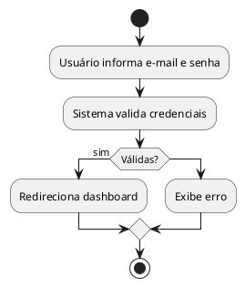
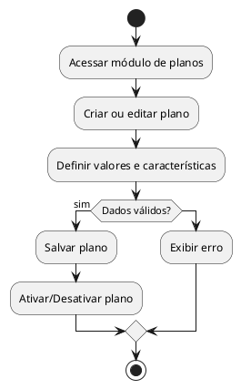
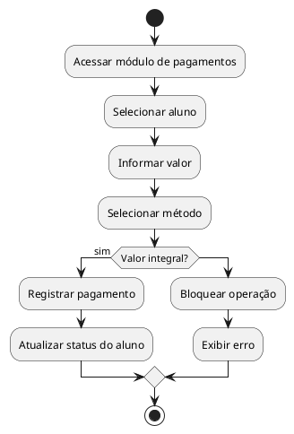
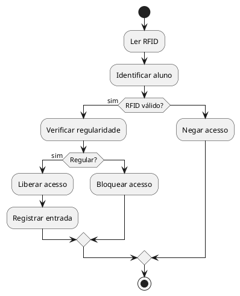
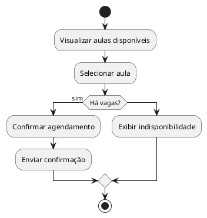
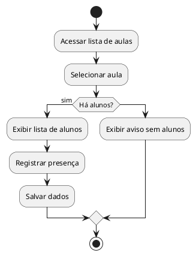
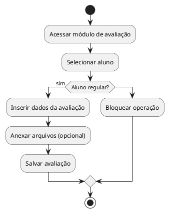
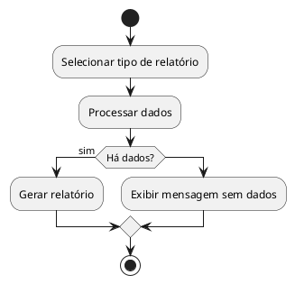
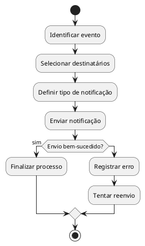

# Documento de Modelagem - FitPass Gym Management

# 1. Diagrama de Casos de Uso (Descrição Geral)

**Atores:**
- Usuário (Aluno)
- Recepcionista
- Instrutor
- Gerente
- Sistema de Pagamento
- Catraca (RFID)

**Casos de Uso:**
- UC01 - Realizar Login  
- UC02 - Cadastrar Aluno  
- UC03 - Gerenciar Planos  
- UC04 - Registrar Pagamento  
- UC05 - Validar Acesso  
- UC06 - Agendar Aula  
- UC07 - Registrar Presença  
- UC08 - Registrar Avaliação Física  
- UC09 - Emitir Relatórios  
- UC10 - Enviar Notificações  

# 2. Casos de Uso + Diagramas de Atividade

## UC01 - Realizar Login

**Ator Principal:** Usuário  
**Objetivo:** Permitir acesso ao sistema  

**Pré-condições:**
- Usuário cadastrado

**Pós-condições:**
- Sessão iniciada

**Fluxo Principal:**
1. Usuário informa e-mail e senha  
2. Sistema valida credenciais  
3. Sistema autentica e redireciona  

**Fluxos Alternativos:**
- A1: Senha incorreta - exibe erro  
- A2: Conta bloqueada - impede acesso  

**RF:** RF01  
**RN:** RN06  
**RNF:** RNF02  

### Diagrama de Atividade

# Documento de Modelagem - FitPass Gym Management

# 1. Diagrama de Casos de Uso (Descrição Geral)

**Atores:**
- Usuário (Aluno)
- Recepcionista
- Instrutor
- Gerente
- Sistema de Pagamento
- Catraca (RFID)

**Casos de Uso:**
- UC01 - Realizar Login  
- UC02 - Cadastrar Aluno  
- UC03 - Gerenciar Planos  
- UC04 - Registrar Pagamento  
- UC05 - Validar Acesso  
- UC06 - Agendar Aula  
- UC07 - Registrar Presença  
- UC08 - Registrar Avaliação Física  
- UC09 - Emitir Relatórios  
- UC10 - Enviar Notificações  

# 2. Casos de Uso + Diagramas de Atividade

## UC01 - Realizar Login

**Ator Principal:** Usuário  
**Objetivo:** Permitir acesso ao sistema  

**Pré-condições:**
- Usuário cadastrado

**Pós-condições:**
- Sessão iniciada

**Fluxo Principal:**
1. Usuário informa e-mail e senha  
2. Sistema valida credenciais  
3. Sistema autentica e redireciona  

**Fluxos Alternativos:**
- A1: Senha incorreta - exibe erro  
- A2: Conta bloqueada - impede acesso  

**RF:** RF01  
**RN:** RN06  
**RNF:** RNF02  

### Diagrama de Atividade

## UC03 - Gerenciar Planos

**Ator Principal:** Gerente  
**Objetivo:** Criar, editar, ativar e desativar planos disponíveis no sistema  

### Pré-condições
- Gerente autenticado no sistema  

### Pós-condições
- Plano criado, atualizado ou alterado com sucesso  

### Fluxo Principal
1. Gerente acessa o módulo de planos  
2. Seleciona a opção de criar ou editar plano  
3. Informa nome, tipo e características do plano  
4. Define valores e periodicidade  
5. Sistema valida os dados  
6. Sistema salva o plano  
7. Gerente ativa ou desativa o plano  

### Fluxos Alternativos
- A1 - Dados inválidos:  
  Sistema exibe mensagem de erro e solicita correção  

### RF Relacionados
- RF02  

### RN Relacionadas
- RN06  

### RNF Relacionados
- RNF05  
- RNF04  

### Diagrama de Atividade

## UC04 - Registrar Pagamento

**Ator Principal:** Recepcionista  
**Objetivo:** Registrar o pagamento da mensalidade do aluno  

### Pré-condições
- Recepcionista autenticado  
- Aluno cadastrado no sistema  

### Pós-condições
- Pagamento registrado com sucesso  
- Situação do aluno atualizada automaticamente  

### Fluxo Principal
1. Recepcionista acessa o módulo de pagamentos  
2. Seleciona o aluno  
3. Informa o valor do pagamento  
4. Seleciona o método (dinheiro, cartão ou PIX)  
5. Sistema valida o valor informado  
6. Sistema registra o pagamento  
7. Sistema atualiza automaticamente a regularidade do aluno  

### Fluxos Alternativos
- A1 - Pagamento parcial:  
  O sistema bloqueia a operação e informa que o pagamento deve ser integral  

- A2 - Falha no registro:  
  O sistema exibe mensagem de erro e solicita nova tentativa  

### RF Relacionados
- RF03  

### RN Relacionadas
- RN04  
- RN07  

### RNF Relacionados
- RNF03  

### Diagrama de Atividade

## UC05 - Validar Acesso

**Ator Principal:** Sistema/Catraca  
**Objetivo:** Permitir ou bloquear a entrada do aluno na academia  

### Pré-condições
- Aluno cadastrado no sistema  
- Sistema integrado com a catraca via RFID  
- Aluno possui identificação válida (RFID)  

### Pós-condições
- Acesso liberado, ou  
- Acesso bloqueado  

### Fluxo Principal
1. A catraca realiza a leitura do RFID do aluno  
2. O sistema identifica o aluno  
3. O sistema verifica a regularidade do aluno  
4. O sistema libera o acesso  
5. A entrada do aluno é registrada no sistema  

### Fluxos Alternativos
- A1 - Aluno inadimplente:  
  O sistema bloqueia o acesso e exibe mensagem de pendência  

- A2 - RFID inválido ou não encontrado:  
  O sistema nega o acesso e exibe erro  

### RF Relacionados
- RF05  

### RN Relacionadas
- RN01  
- RN07  

### RNF Relacionados
- RNF03  
- RNF06  

### Diagrama de Atividade

## UC06 - Agendar Aula

**Ator Principal:** Usuário  
**Objetivo:** Permitir que o aluno reserve uma vaga em uma aula  

### Pré-condições
- Usuário autenticado  
- Aluno ativo e regular  

### Pós-condições
- Aula agendada com sucesso  

### Fluxo Principal
1. Usuário acessa a lista de aulas disponíveis  
2. Sistema exibe horários e vagas  
3. Usuário seleciona uma aula  
4. Sistema verifica disponibilidade  
5. Sistema confirma o agendamento  
6. Sistema envia confirmação ao usuário  

### Fluxos Alternativos
- A1 - Aula lotada:  
  O sistema informa indisponibilidade de vagas  

- A2 - Cancelamento fora do prazo:  
  O sistema impede o cancelamento  

### RF Relacionados
- RF06  

### RN Relacionadas
- RN02  
- RN03  

### RNF Relacionados
- RNF04  

### Diagrama de Atividade

## UC07 - Registrar Presença

**Ator Principal:** Instrutor  
**Objetivo:** Registrar a presença dos alunos nas aulas  

### Pré-condições
- Instrutor autenticado no sistema  
- Aula previamente agendada  

### Pós-condições
- Presença dos alunos registrada com sucesso  

### Fluxo Principal
1. Instrutor acessa a lista de aulas  
2. Seleciona a aula em andamento  
3. Sistema exibe lista de alunos inscritos  
4. Instrutor marca a presença dos alunos  
5. Sistema salva as informações  

### Fluxos Alternativos
- A1 - Aula sem alunos inscritos:  
  Sistema exibe mensagem informando ausência de alunos  

- A2 - Falha ao salvar:  
  Sistema informa erro e solicita nova tentativa  

### RF Relacionados
- RF07  

### RN Relacionadas
- RN06  

### RNF Relacionados
- RNF03  

### Diagrama de Atividade

## UC08 - Registrar Avaliação Física

**Ator Principal:** Instrutor  
**Objetivo:** Registrar a avaliação física do aluno  

### Pré-condições
- Instrutor autenticado  
- Aluno cadastrado  
- Aluno ativo e com mensalidade em dia  

### Pós-condições
- Avaliação física registrada com sucesso  

### Fluxo Principal
1. Instrutor acessa o módulo de avaliação física  
2. Instrutor seleciona o aluno  
3. Sistema verifica a regularidade do aluno  
4. Instrutor insere os dados da avaliação (peso, IMC, percentual de gordura, etc.)  
5. Instrutor anexa arquivos (opcional)  
6. Sistema salva a avaliação  

### Fluxos Alternativos
- A1 - Aluno irregular:  
  O sistema bloqueia o registro da avaliação  

### RF Relacionados
- RF08  

### RN Relacionadas
- RN05  

### RNF Relacionados
- RNF02  
- RNF04  

### Diagrama de Atividade

## UC09 - Emitir Relatórios

**Ator Principal:** Gerente  
**Objetivo:** Gerar relatórios gerenciais do sistema  

### Pré-condições
- Gerente autenticado no sistema  

### Pós-condições
- Relatório gerado com sucesso  

### Fluxo Principal
1. Gerente acessa o módulo de relatórios  
2. Seleciona o tipo de relatório (inadimplência, alunos ativos, histórico de acessos, ocupação das aulas)  
3. Sistema processa os dados  
4. Sistema gera e exibe o relatório  

### Fluxos Alternativos
- A1 - Sem dados disponíveis:  
  O sistema informa que não há dados para o relatório selecionado  

### RF Relacionados
- RF09  

### RN Relacionadas
- RN06  

### RNF Relacionados
- RNF03  
- RNF05  

### Diagrama de Atividade

## UC10 - Enviar Notificações

**Ator Principal:** Sistema  
**Objetivo:** Notificar usuários sobre eventos relevantes  

### Pré-condições
- Evento disparador identificado (ex.: vencimento, agendamento, avaliação)

### Pós-condições
- Notificação enviada ao usuário  

### Fluxo Principal
1. Sistema identifica evento  
2. Sistema seleciona usuários afetados  
3. Sistema define tipo de notificação  
4. Sistema envia notificação  

### Fluxos Alternativos
- A1 - Falha no envio:  
  Sistema registra erro e tenta reenvio  

### RF Relacionados
- RF10  

### RN Relacionadas
- RN07  

### RNF Relacionados
- RNF01  
- RNF02  

### Diagrama de Atividade

