# Estudo de Caso - FitPass Gym Management
Autores: Igor Paiva e Fabio Bragagnolo

---

## UC01 — Realizar Login

### Ator Principal
Aluno / Recepcionista / Instrutor / Gerente

### Objetivo
Permitir que o usuário acesse o sistema de gestão da academia.

### Pré-condições
- Usuário deve possuir cadastro ativo.

### Pós-condições
- Sessão iniciada com sucesso.

### Fluxo Principal
1. O usuário informa e-mail e senha.
2. O sistema valida as credenciais.
3. O sistema autentica o usuário e redireciona para a tela inicial.

### Fluxos Alternativos
- **A1 — Senha incorreta:**  
  O sistema exibe mensagem de erro.

- **A2 — Conta bloqueada:**  
  O sistema impede o login e instrui o usuário a recuperar o acesso.

### RF Relacionados
- RF01 — Autenticação de usuários

### RNF Relacionados
- RNF01 — Sistema deve autenticar usuários em até 3 segundos

### RN Relacionadas
- RN01 — Usuário não autenticado não pode acessar funções do sistema

### Diagrama de Atividade
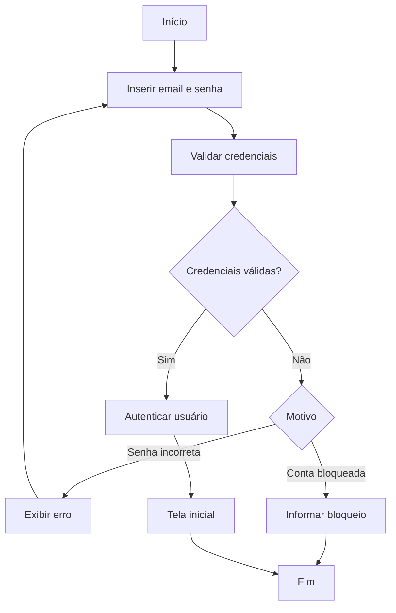
```mermaid
flowchart TD
A[Início] --> B[Inserir email e senha]
B --> C[Validar credenciais]
C --> D{Credenciais válidas?}
D -->|Não| E{Motivo}
E -->|Senha incorreta| F[Exibir erro]
E -->|Conta bloqueada| G[Informar bloqueio]
F --> B
G --> H[Fim]
D -->|Sim| I[Autenticar usuário]
I --> J[Tela inicial]
J --> H
```

---

## UC02 — Realizar Matrícula

### Ator Principal
Recepcionista

### Objetivo
Cadastrar um novo aluno no sistema da academia.

### Pré-condições
- Aluno não deve estar previamente cadastrado.

### Pós-condições
- Matrícula registrada com sucesso.

### Fluxo Principal
1. Recepcionista insere os dados do aluno.
2. O sistema valida os dados.
3. O sistema confirma a matrícula.

### Fluxos Alternativos
- **A1 — Dados incompletos:**  
  Sistema solicita correção dos campos obrigatórios.

- **A2 — Matrícula duplicada:**  
  Sistema alerta sobre cadastro existente.

### RF Relacionados
- RF02 — Cadastro de alunos

### RNF Relacionados
- RNF02 — Sistema deve salvar informações em banco seguro

### RN Relacionadas
- RN02 — Matrículas duplicadas não são permitidas

### Diagrama de Atividade
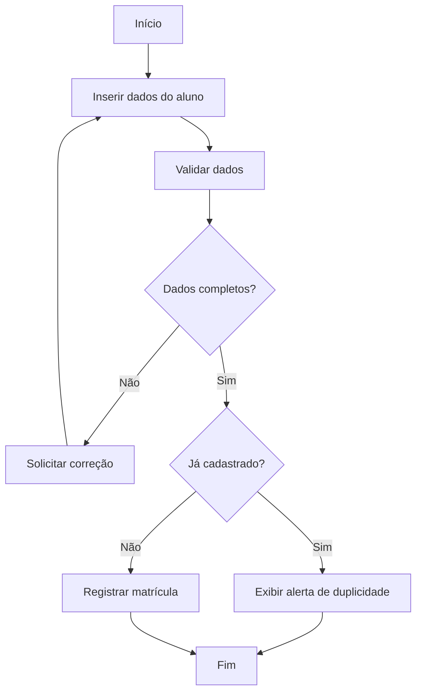
```mermaid
flowchart TD
A[Início] --> B[Inserir dados do aluno]
B --> C[Validar dados]
C --> D{Dados completos?}
D -->|Não| E[Solicitar correção]
E --> B
D -->|Sim| F{Já cadastrado?}
F -->|Sim| G[Exibir alerta de duplicidade]
F -->|Não| H[Registrar matrícula]
G --> I[Fim]
H --> I
```
---

## UC03 — Registrar Pagamento

### Ator Principal
Recepcionista

### Objetivo
Registrar o pagamento da mensalidade do aluno.

### Pré-condições
- Aluno deve ter matrícula ativa.

### Pós-condições
- Pagamento registrado e saldo atualizado.

### Fluxo Principal
1. Recepcionista seleciona o aluno.
2. Informa o valor e forma de pagamento.
3. Sistema confirma o pagamento.

### Fluxos Alternativos
- **A1 — Pagamento recusado:**  
  Sistema exibe mensagem de erro e solicita nova tentativa.

### RF Relacionados
- RF03 — Registro de pagamentos

### RNF Relacionados
- RNF03 — Registro deve ser salvo em até 2 segundos

### RN Relacionadas
- RN03 — Pagamento não processado não deve atualizar saldo

### Diagrama de Atividade
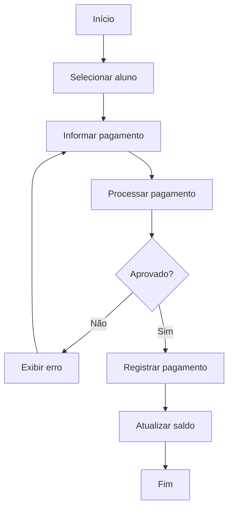
```mermaid
flowchart TD
A[Início] --> B[Selecionar aluno]
B --> C[Informar pagamento]
C --> D[Processar pagamento]
D --> E{Aprovado?}
E -->|Não| F[Exibir erro]
F --> C
E -->|Sim| G[Registrar pagamento]
G --> H[Atualizar saldo]
H --> I[Fim]
```
---

## UC04 — Agendar Aula

### Ator Principal
Aluno

### Objetivo
Permitir que o aluno agende aulas de acordo com disponibilidade.

### Pré-condições
- Aluno deve estar matriculado e ativo.

### Pós-condições
- Aula agendada no sistema.

### Fluxo Principal
1. Aluno seleciona a aula desejada.
2. Sistema verifica disponibilidade.
3. Sistema confirma o agendamento.

### Fluxos Alternativos
- **A1 — Aula lotada:**  
  Sistema sugere horários alternativos.

### RF Relacionados
- RF04 — Agendamento de aulas

### RNF Relacionados
- RNF04 — Sistema deve atualizar agenda em tempo real

### RN Relacionadas
- RN04 — Aula só pode ser agendada se houver vaga

### Diagrama de Atividade
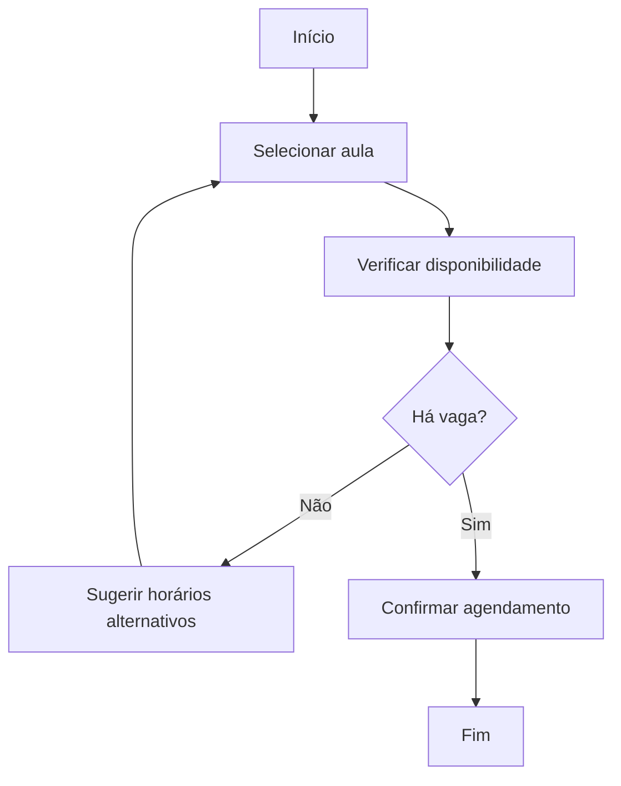
```mermaid
flowchart TD
A[Início] --> B[Selecionar aula]
B --> C[Verificar disponibilidade]
C --> D{Há vaga?}
D -->|Não| E[Sugerir horários alternativos]
E --> B
D -->|Sim| F[Confirmar agendamento]
F --> G[Fim]
```
---

## UC05 — Registrar Presença

### Ator Principal
Instrutor / Sistema de Catraca

### Objetivo
Registrar a presença do aluno em aulas.

### Pré-condições
- Aula deve estar agendada.

### Pós-condições
- Presença registrada no sistema.

### Fluxo Principal
1. Aluno entra na sala e valida acesso via catraca.
2. Sistema registra presença automaticamente.
3. Instrutor pode confirmar presenças.

### Fluxos Alternativos
- **A1 — Falha na leitura da catraca:**  
  Instrutor registra presença manualmente.

### RF Relacionados
- RF05 — Registro de presença

### RNF Relacionados
- RNF05 — Registro de presença em tempo real

### RN Relacionadas
- RN05 — Presença só é válida se aluno estiver matriculado

### Diagrama de Atividade
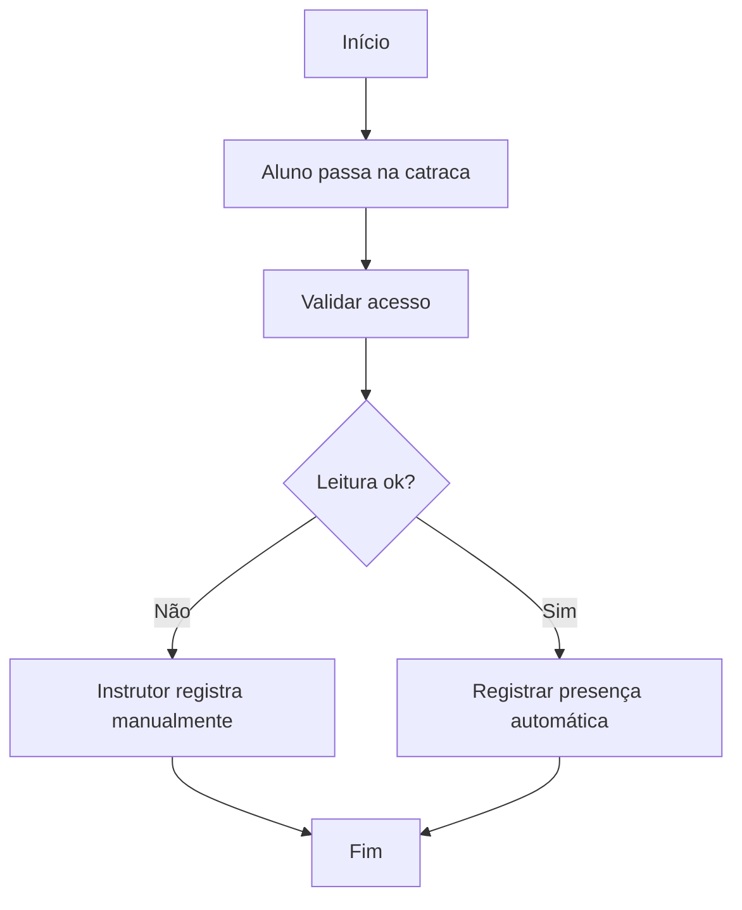
```mermaid
flowchart TD
A[Início] --> B[Aluno passa na catraca]
B --> C[Validar acesso]
C --> D{Leitura ok?}
D -->|Não| E[Instrutor registra manualmente]
E --> F[Fim]
D -->|Sim| G[Registrar presença automática]
G --> F
```

---

## UC06 — Consultar Agenda de Aulas

### Ator Principal
Aluno / Instrutor

### Objetivo
Permitir consulta aos horários de aulas disponíveis.

### Pré-condições
- Usuário deve estar autenticado.

### Pós-condições
- Agenda exibida corretamente.

### Fluxo Principal
1. Usuário acessa tela de agenda.
2. Sistema apresenta horários e disponibilidade.

### Fluxos Alternativos
- **A1 — Sem aulas disponíveis:**  
  Sistema informa que não há horários disponíveis.

### RF Relacionados
- RF06 — Consulta de agenda

### RNF Relacionados
- RNF06 — Sistema deve carregar agenda em até 3 segundos

### RN Relacionadas
- RN06 — Agenda não deve mostrar aulas canceladas

### Diagrama de Atividade
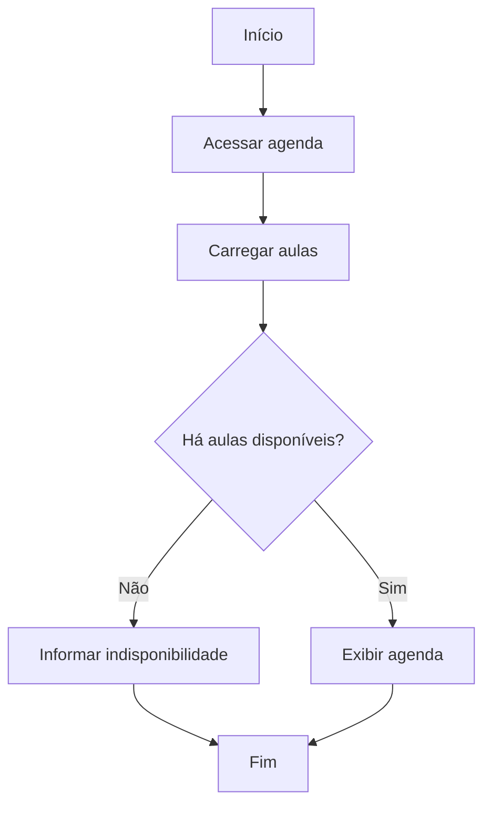
```mermaid
flowchart TD
A[Início] --> B[Acessar agenda]
B --> C[Carregar aulas]
C --> D{Há aulas disponíveis?}
D -->|Não| E[Informar indisponibilidade]
D -->|Sim| F[Exibir agenda]
E --> G[Fim]
F --> G
```
---

## UC07 — Cancelar Agendamento

### Ator Principal
Aluno

### Objetivo
Permitir que aluno cancele uma aula previamente agendada.

### Pré-condições
- Aula deve estar agendada pelo aluno.

### Pós-condições
- Agendamento cancelado.

### Fluxo Principal
1. Aluno seleciona a aula agendada.
2. Confirma cancelamento.
3. Sistema atualiza disponibilidade da aula.

### Fluxos Alternativos
- **A1 — Cancelamento fora do prazo:**  
  Sistema impede cancelamento e informa regras.

### RF Relacionados
- RF07 — Cancelamento de aula

### RNF Relacionados
- RNF07 — Cancelamento deve atualizar agenda em tempo real

### RN Relacionadas
- RN07 — Aula só pode ser cancelada dentro do prazo permitido

### Diagrama de Atividade
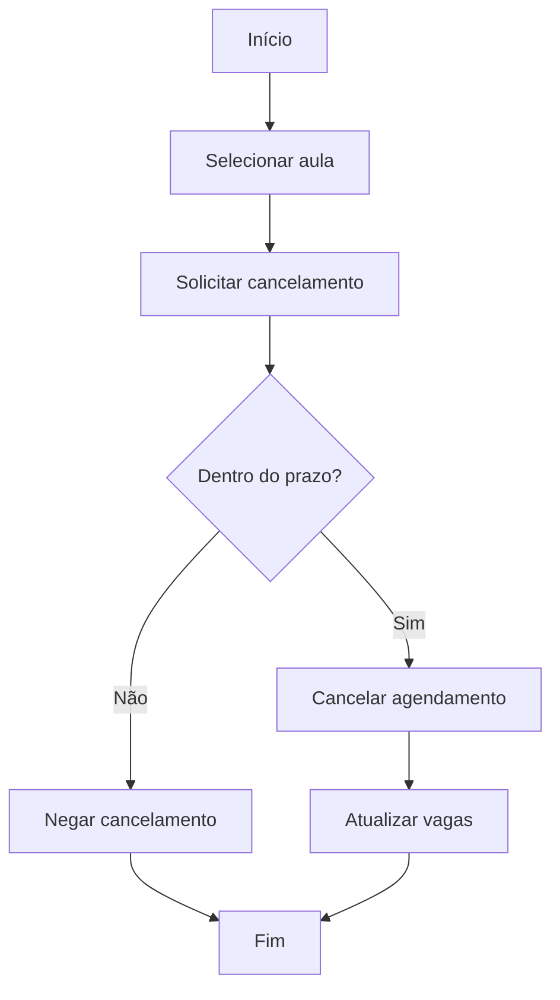
```mermaid
flowchart TD
A[Início] --> B[Selecionar aula]
B --> C[Solicitar cancelamento]
C --> D{Dentro do prazo?}
D -->|Não| E[Negar cancelamento]
E --> F[Fim]
D -->|Sim| G[Cancelar agendamento]
G --> H[Atualizar vagas]
H --> F
```
---

## UC08 — Consultar Saldo de Pagamento

### Ator Principal
Aluno

### Objetivo
Permitir que aluno verifique seu saldo de mensalidade.

### Pré-condições
- Aluno deve estar matriculado.

### Pós-condições
- Saldo exibido corretamente.

### Fluxo Principal
1. Aluno acessa a tela de pagamentos.
2. Sistema mostra saldo atualizado.

### Fluxos Alternativos
- **A1 — Sistema fora do ar:**  
  Sistema informa indisponibilidade.

### RF Relacionados
- RF08 — Consulta de saldo

### RNF Relacionados
- RNF08 — Sistema deve atualizar saldo em até 2 segundos

### RN Relacionadas
- RN08 — Saldo exibido só se aluno estiver ativo

### Diagrama de Atividade
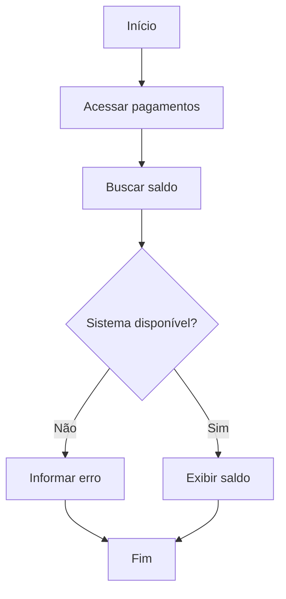
```mermaid
flowchart TD
A[Início] --> B[Acessar pagamentos]
B --> C[Buscar saldo]
C --> D{Sistema disponível?}
D -->|Não| E[Informar erro]
D -->|Sim| F[Exibir saldo]
E --> G[Fim]
F --> G
```
---

## UC09 — Emitir Relatórios Financeiros

### Ator Principal
Gerente

### Objetivo
Gerar relatórios financeiros da academia.

### Pré-condições
- Usuário deve ser gerente autenticado.

### Pós-condições
- Relatório gerado e disponível para download.

### Fluxo Principal
1. Gerente seleciona tipo de relatório.
2. Sistema gera relatório.
3. Relatório é exibido para download.

### Fluxos Alternativos
- **A1 — Falha ao gerar relatório:**  
  Sistema informa erro e sugere nova tentativa.

### RF Relacionados
- RF09 — Relatórios financeiros

### RNF Relacionados
- RNF09 — Sistema deve gerar relatório em até 5 segundos

### RN Relacionadas
- RN09 — Relatório só exibe dados válidos e confirmados

### Diagrama de Atividade
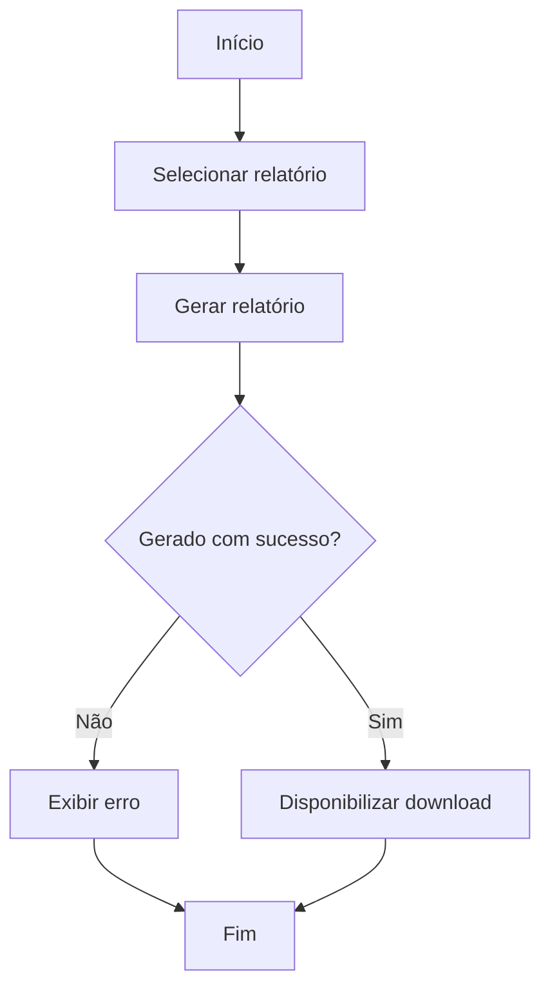
```mermaid
flowchart TD
A[Início] --> B[Selecionar relatório]
B --> C[Gerar relatório]
C --> D{Gerado com sucesso?}
D -->|Não| E[Exibir erro]
D -->|Sim| F[Disponibilizar download]
E --> G[Fim]
F --> G
```
---

## UC10 — Emitir Relatórios de Presença

### Ator Principal
Gerente / Instrutor

### Objetivo
Gerar relatórios de presença de alunos em aulas.

### Pré-condições
- Usuário deve estar autenticado.

### Pós-condições
- Relatório gerado.

### Fluxo Principal
1. Usuário seleciona período e turma.
2. Sistema gera relatório.
3. Relatório exibido para download.

### Fluxos Alternativos
- **A1 — Dados incompletos:**  
  Sistema alerta sobre registros incompletos.

### RF Relacionados
- RF10 — Relatórios de presença

### RNF Relacionados
- RNF10 — Sistema deve gerar relatório em até 5 segundos

### RN Relacionadas
- RN10 — Relatório só inclui alunos matriculados

### Diagrama de Atividade
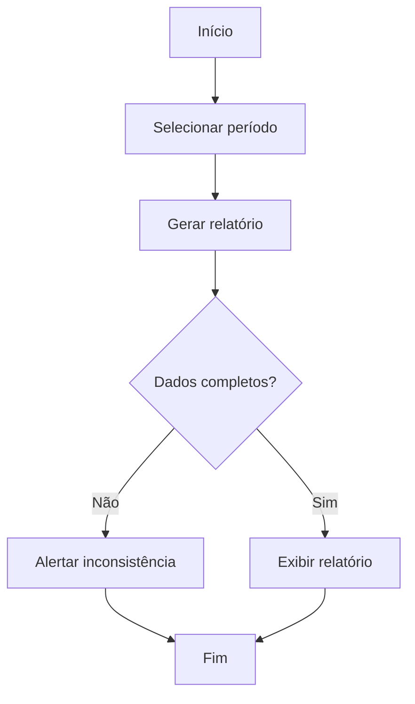
```mermaid
flowchart TD
A[Início] --> B[Selecionar período]
B --> C[Gerar relatório]
C --> D{Dados completos?}
D -->|Não| E[Alertar inconsistência]
D -->|Sim| F[Exibir relatório]
E --> G[Fim]
F --> G
```

---

## UC11 — Registrar Acesso na Catraca

### Ator Principal
Aluno / Sistema de Catraca

### Objetivo
Controlar entrada do aluno na academia.

### Pré-condições
- Aluno deve estar matriculado e ativo.

### Pós-condições
- Entrada registrada no sistema.

### Fluxo Principal
1. Aluno aproxima cartão RFID da catraca.
2. Sistema valida matrícula.
3. Sistema libera acesso.

### Fluxos Alternativos
- **A1 — Cartão inválido:**  
  Sistema bloqueia acesso e exibe mensagem.

### RF Relacionados
- RF11 — Controle de acesso

### RNF Relacionados
- RNF11 — Sistema deve processar leitura em 1 segundo

### RN Relacionadas
- RN11 — Apenas alunos ativos têm acesso permitido

### Diagrama de Atividade
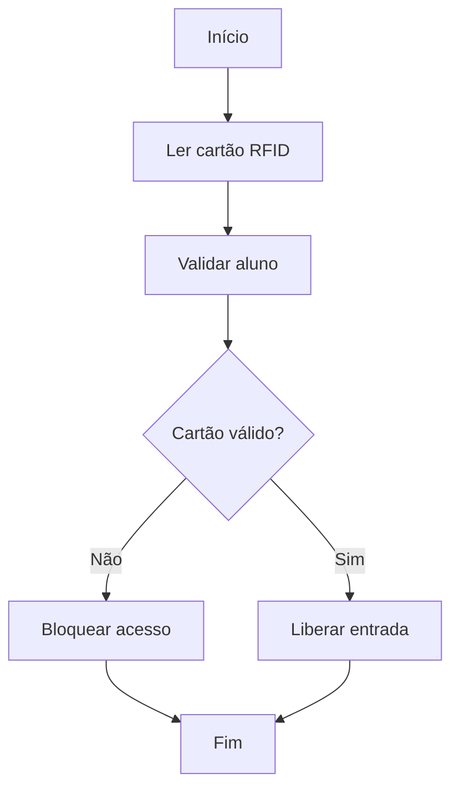
```mermaid
flowchart TD
A[Início] --> B[Ler cartão RFID]
B --> C[Validar aluno]
C --> D{Cartão válido?}
D -->|Não| E[Bloquear acesso]
D -->|Sim| F[Liberar entrada]
E --> G[Fim]
F --> G
```
---

## UC12 — Bloquear Acesso

### Ator Principal
Gerente / Recepcionista

### Objetivo
Bloquear acesso de alunos com pendências.

### Pré-condições
- Aluno deve ter matrícula ativa.

### Pós-condições
- Acesso bloqueado.

### Fluxo Principal
1. Usuário seleciona aluno com pendência.
2. Sistema bloqueia acesso na catraca.

### Fluxos Alternativos
- **A1 — Falha na conexão:**  
  Sistema informa erro e solicita nova tentativa.

### RF Relacionados
- RF12 — Bloqueio de acesso

### RNF Relacionados
- RNF12 — Sistema deve atualizar status de acesso imediatamente

### RN Relacionadas
- RN12 — Aluno com pendência não pode acessar

### Diagrama de Atividade
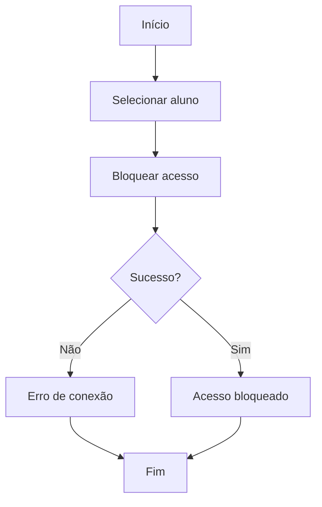
```mermaid
flowchart TD
A[Início] --> B[Selecionar aluno]
B --> C[Bloquear acesso]
C --> D{Sucesso?}
D -->|Não| E[Erro de conexão]
D -->|Sim| F[Acesso bloqueado]
E --> G[Fim]
F --> G
```
---

## UC13 — Reativar Matrícula

### Ator Principal
Recepcionista / Gerente

### Objetivo
Reativar matrícula suspensa ou cancelada.

### Pré-condições
- Aluno deve ter matrícula existente.

### Pós-condições
- Matrícula reativada e acesso liberado.

### Fluxo Principal
1. Usuário seleciona aluno.
2. Confirma reativação.
3. Sistema atualiza status.

### Fluxos Alternativos
- **A1 — Aluno inadimplente:**  
  Sistema impede reativação até regularização.

### RF Relacionados
- RF13 — Reativação de matrícula

### RNF Relacionados
- RNF13 — Atualização deve ocorrer em tempo real

### RN Relacionadas
- RN13 — Aluno só é reativado se estiver regular

### Diagrama de Atividade
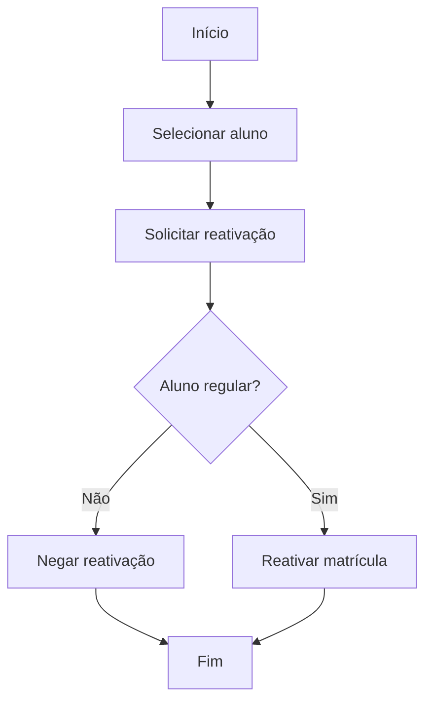
```mermaid
flowchart TD
A[Início] --> B[Selecionar aluno]
B --> C[Solicitar reativação]
C --> D{Aluno regular?}
D -->|Não| E[Negar reativação]
D -->|Sim| F[Reativar matrícula]
E --> G[Fim]
F --> G
```
---

## UC14 — Cancelar Matrícula

### Ator Principal
Aluno / Recepcionista / Gerente

### Objetivo
Cancelar matrícula de aluno.

### Pré-condições
- Aluno deve estar matriculado.

### Pós-condições
- Matrícula cancelada e acesso revogado.

### Fluxo Principal
1. Solicitação de cancelamento é realizada.
2. Sistema confirma e atualiza status.

### Fluxos Alternativos
- **A1 — Pagamento pendente:**  
  Sistema bloqueia cancelamento até regularização.

### RF Relacionados
- RF14 — Cancelamento de matrícula

### RNF Relacionados
- RNF14 — Sistema deve atualizar status em tempo real

### RN Relacionadas
- RN14 — Aluno não pode acessar após cancelamento

### Diagrama de Atividade
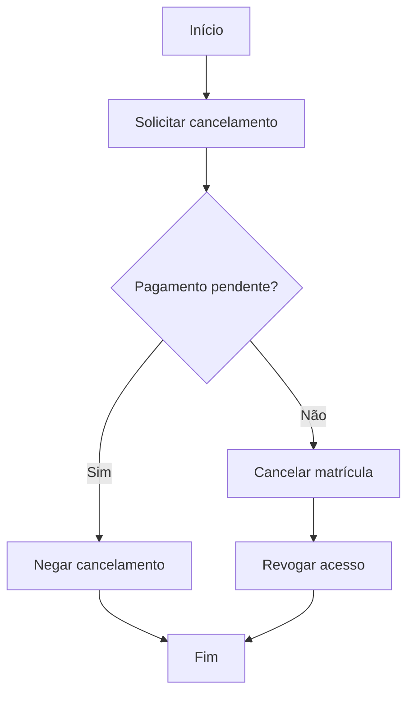
```mermaid
flowchart TD
A[Início] --> B[Solicitar cancelamento]
B --> C{Pagamento pendente?}
C -->|Sim| D[Negar cancelamento]
C -->|Não| E[Cancelar matrícula]
E --> F[Revogar acesso]
D --> G[Fim]
F --> G
```
---

## UC15 — Atualizar Dados do Aluno

### Ator Principal
Recepcionista / Aluno

### Objetivo
Atualizar informações pessoais do aluno.

### Pré-condições
- Aluno deve estar matriculado.

### Pós-condições
- Dados atualizados no sistema.

### Fluxo Principal
1. Usuário altera dados.
2. Sistema valida e salva as alterações.

### Fluxos Alternativos
- **A1 — Dados inválidos:**  
  Sistema solicita correção.

### RF Relacionados
- RF15 — Atualização de cadastro

### RNF Relacionados
- RNF15 — Sistema deve validar todos os campos obrigatórios

### RN Relacionadas
- RN15 — Alterações só são válidas se o aluno estiver ativo

### Diagrama de Atividade
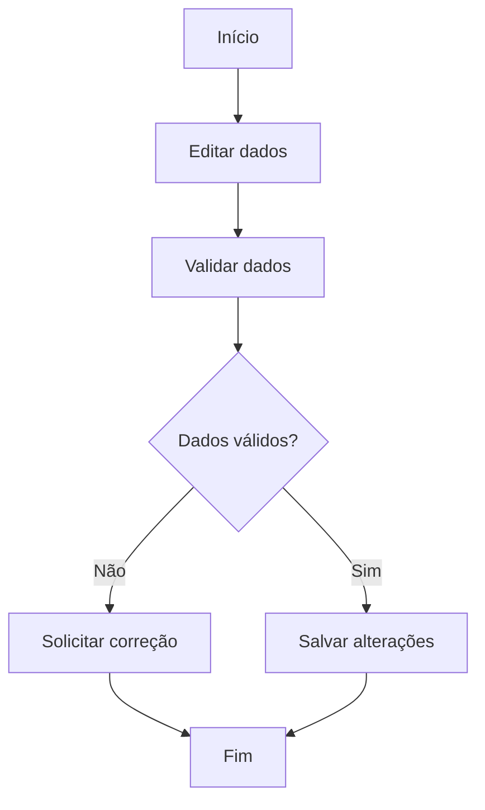
```mermaid
flowchart TD
A[Início] --> B[Editar dados]
B --> C[Validar dados]
C --> D{Dados válidos?}
D -->|Não| E[Solicitar correção]
D -->|Sim| F[Salvar alterações]
E --> G[Fim]
F --> G
```

---

## UC16 — Enviar Notificação

### Ator Principal
Sistema / Gerente

### Objetivo
Enviar avisos sobre aulas ou pagamentos.

### Pré-condições
- Aluno deve ter contato cadastrado.

### Pós-condições
- Notificação enviada.

### Fluxo Principal
1. Gerente seleciona destinatários.
2. Sistema envia notificação.

### Fluxos Alternativos
- **A1 — Falha no envio:**  
  Sistema registra erro e tenta novamente.

### RF Relacionados
- RF16 — Notificações automáticas

### RNF Relacionados
- RNF16 — Sistema deve enviar notificação em até 5 segundos

### RN Relacionadas
- RN16 — Notificação só é enviada para alunos ativos

### Diagrama de Atividade
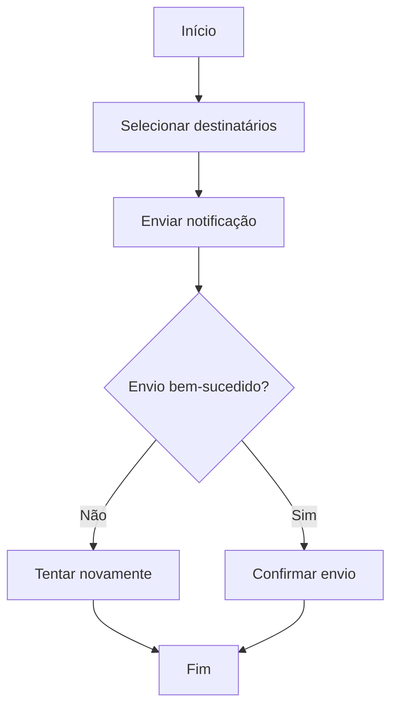
```mermaid
flowchart TD
A[Início] --> B[Selecionar destinatários]
B --> C[Enviar notificação]
C --> D{Envio bem-sucedido?}
D -->|Não| E[Tentar novamente]
D -->|Sim| F[Confirmar envio]
E --> G[Fim]
F --> G
```

---

## UC17 — Consultar Histórico de Presença

### Ator Principal
Aluno / Instrutor

### Objetivo
Permitir consulta de presença em aulas anteriores.

### Pré-condições
- Aluno deve estar matriculado.

### Pós-condições
- Histórico exibido corretamente.

### Fluxo Principal
1. Usuário acessa histórico.
2. Sistema mostra registro de presença.

### Fluxos Alternativos
- **A1 — Sem registros:**  
  Sistema informa que não há dados disponíveis.

### RF Relacionados
- RF17 — Histórico de presença

### RNF Relacionados
- RNF17 — Sistema deve exibir histórico em até 3 segundos

### RN Relacionadas
- RN17 — Apenas alunos ativos têm histórico visível

### Fluxos Alternativos
- A1 — Sem registros  

### Diagrama de Atividade
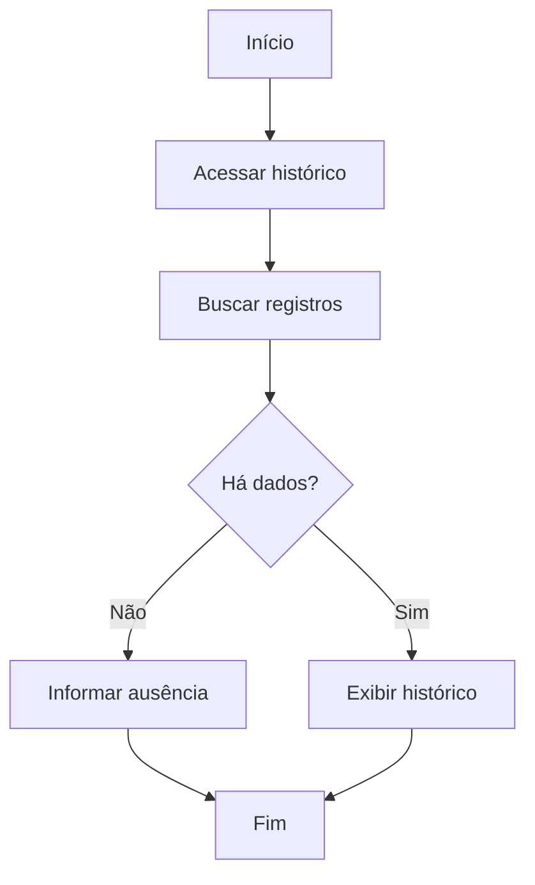
```mermaid
flowchart TD
A[Início] --> B[Acessar histórico]
B --> C[Buscar registros]
C --> D{Há dados?}
D -->|Não| E[Informar ausência]
D -->|Sim| F[Exibir histórico]
E --> G[Fim]
F --> G
```

---

## UC18 — Gerar Relatórios Gerenciais

### Ator Principal
Gerente

### Objetivo
Fornecer visão gerencial das atividades da academia.

### Pré-condições
- Usuário deve estar autenticado.

### Pós-condições
- Relatórios gerados.

### Fluxo Principal
1. Gerente seleciona tipo de relatório.
2. Sistema gera relatório.
3. Relatório exibido e disponível para download.

### Fluxos Alternativos
- **A1 — Dados inconsistentes:**  
  Sistema alerta para inconsistência e impede geração.

### RF Relacionados
- RF18 — Relatórios gerenciais

### RNF Relacionados
- RNF18 — Sistema deve gerar relatórios em até 5 segundos

### RN Relacionadas
- RN18 — Relatórios só incluem dados válidos

### Diagrama de Atividade
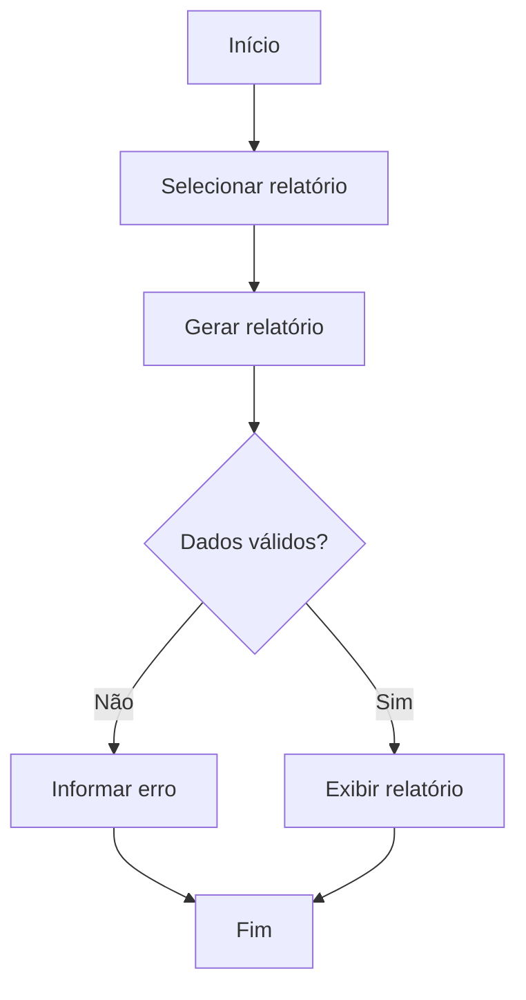
```mermaid
flowchart TD
A[Início] --> B[Selecionar relatório]
B --> C[Gerar relatório]
C --> D{Dados válidos?}
D -->|Não| E[Informar erro]
D -->|Sim| F[Exibir relatório]
E --> G[Fim]
F --> G
```

---

## UC19 — Recuperar Senha

### Ator Principal
Aluno / Recepcionista / Instrutor / Gerente

### Objetivo
Permitir recuperação de senha em caso de esquecimento.

### Pré-condições
- Usuário deve ter e-mail cadastrado.

### Pós-condições
- Senha redefinida ou link enviado.

### Fluxo Principal
1. Usuário solicita recuperação.
2. Sistema envia e-mail com link de redefinição.
3. Usuário altera senha.

### Fluxos Alternativos
- **A1 — E-mail não cadastrado:**  
  Sistema informa erro e solicita e-mail válido.

### RF Relacionados
- RF19 — Recuperação de senha

### RNF Relacionados
- RNF19 — E-mail deve ser enviado em até 2 segundos

### RN Relacionadas
- RN19 — Usuário só consegue redefinir senha se e-mail estiver ativo

### Diagrama de Atividade
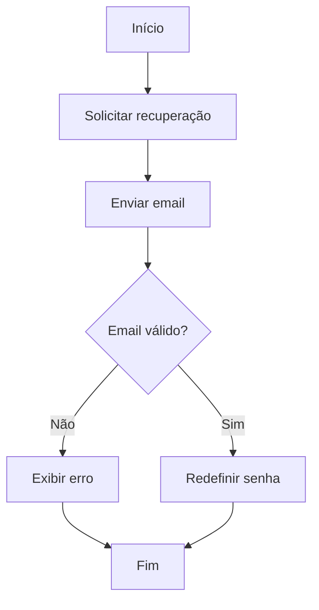
```mermaid
flowchart TD
A[Início] --> B[Solicitar recuperação]
B --> C[Enviar email]
C --> D{Email válido?}
D -->|Não| E[Exibir erro]
D -->|Sim| F[Redefinir senha]
E --> G[Fim]
F --> G
```
---

## UC20 — Encerrar Sessão

### Ator Principal
Aluno / Recepcionista / Instrutor / Gerente

### Objetivo
Permitir que o usuário saia do sistema com segurança.

### Pré-condições
- Usuário deve estar logado.

### Pós-condições
- Sessão encerrada com sucesso.

### Fluxo Principal
1. Usuário clica em “Sair”.
2. Sistema encerra sessão e redireciona para login.

### Fluxos Alternativos
- **A1 — Falha ao encerrar sessão:**  
  Sistema alerta e força encerramento na próxima tentativa.

### RF Relacionados
- RF20 — Encerramento de sessão

### RNF Relacionados
- RNF20 — Sistema deve encerrar sessão em até 2 segundos

### RN Relacionadas
- RN20 — Sessão encerrada não permite mais acesso até novo login    

### Diagrama de Atividade
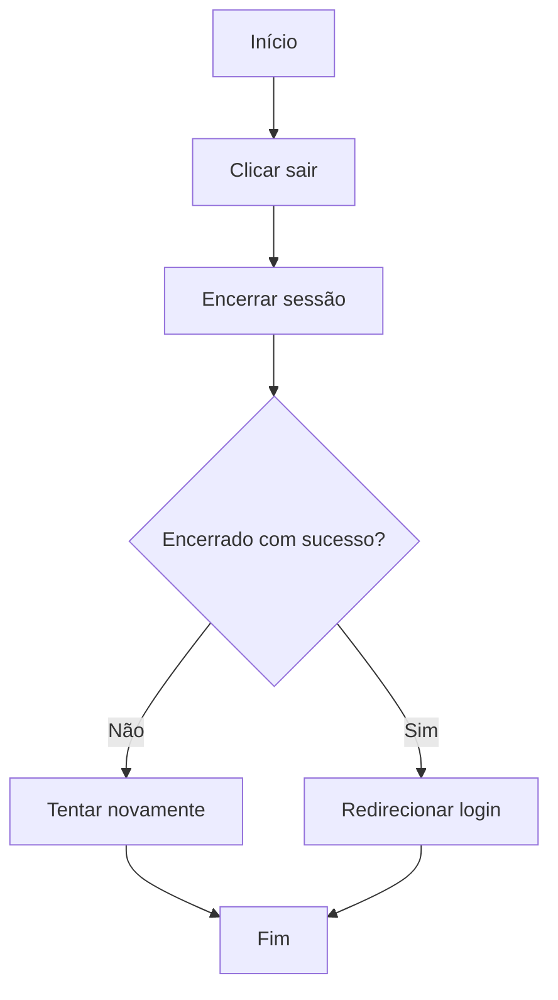
```mermaid
flowchart TD
A[Início] --> B[Clicar sair]
B --> C[Encerrar sessão]
C --> D{Encerrado com sucesso?}
D -->|Não| E[Tentar novamente]
D -->|Sim| F[Redirecionar login]
E --> G[Fim]
F --> G
```
