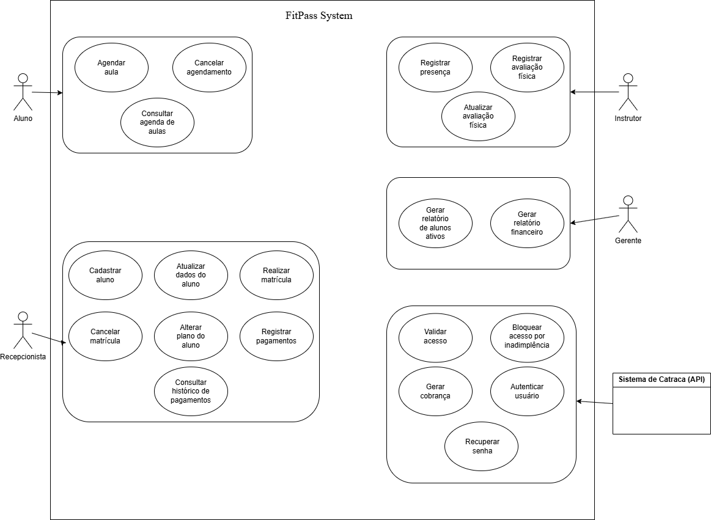
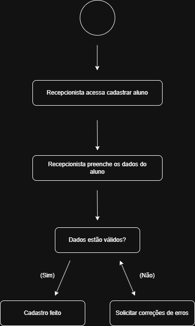
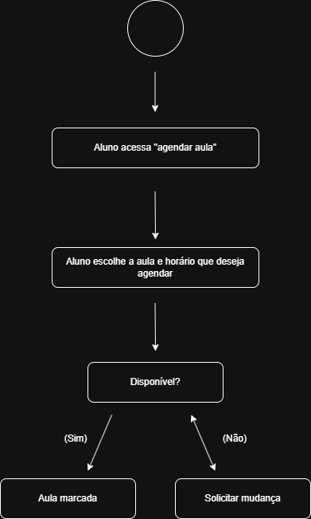

# FitPass Gym Management

Autores: Lucas Vigo Calió e Gustavo de Moraes Donadello

---

## Diagrama de Casos de Uso

---

## Casos de Uso

### UC01 – Cadastrar Aluno

**Atores:** Recepcionista  

**Pré-condições:**  
Recepcionista autenticado no sistema.

**Pós-condições:**  
Aluno cadastrado no sistema.

**Fluxo Principal:**
1. Recepcionista acessa a opção de cadastro de aluno.
2. Informa os dados pessoais do aluno.
3. Confirma o cadastro.
4. Sistema registra o aluno no banco de dados.

**Fluxos Alternativos:**

2a. CPF já cadastrado  
Sistema informa que o CPF já está registrado e cancela o cadastro.

**Requisitos Funcionais Relacionados:**  
RF01 – Cadastro de alunos

**Requisitos Não Funcionais Relacionados:**  
RNF01 – Validação de dados obrigatórios

**Regras de Negócio Relacionadas:**  
RN01 – CPF deve ser único no sistema

---

### UC02 – Atualizar Dados do Aluno

**Atores:** Recepcionista

**Pré-condições:**  
Aluno já cadastrado.

**Pós-condições:**  
Dados do aluno atualizados.

**Fluxo Principal:**

1. Recepcionista busca o aluno no sistema.
2. Seleciona a opção de editar dados.
3. Atualiza as informações necessárias.
4. Sistema salva as alterações.

**Fluxos Alternativos**

3a. Dados inválidos  
Sistema solicita correção das informações.

**Requisitos Funcionais:**  
RF02 – Atualização de dados de alunos

**Requisitos Não Funcionais:**  
RNF01 – Validação de dados

**Regras de Negócio:**  
RN02 – Alterações devem ser registradas no histórico

---

### UC03 – Realizar Matrícula

**Atores:** Recepcionista

**Pré-condições:**  
Aluno cadastrado no sistema.

**Pós-condições:**  
Aluno matriculado em um plano ativo.

**Fluxo Principal**

1. Recepcionista seleciona a opção matrícula.
2. Busca o aluno no sistema.
3. Seleciona um plano disponível.
4. Confirma a matrícula.

**Fluxos Alternativos**

2a. Aluno não encontrado  
Sistema solicita cadastro do aluno.

**Requisitos Funcionais:**  
RF03 – Matrícula de alunos

**Requisitos Não Funcionais:**  
RNF02 – Tempo de resposta inferior a 2 segundos

**Regras de Negócio:**  
RN03 – Todo aluno deve possuir um plano ativo para acessar a academia

---

### UC04 – Cancelar Matrícula

**Atores:** Recepcionista

**Pré-condições:**  
Aluno possui matrícula ativa.

**Pós-condições:**  
Matrícula cancelada.

**Fluxo Principal**

1. Recepcionista localiza a matrícula.
2. Seleciona cancelar matrícula.
3. Confirma a operação.
4. Sistema registra o cancelamento.

**Fluxos Alternativos**

3a. Matrícula já cancelada  
Sistema informa que não é possível cancelar novamente.

**Requisitos Funcionais:**  
RF04 – Cancelamento de matrícula

**Regras de Negócio:**  
RN04 – Cancelamento deve ser registrado no histórico do aluno

---

### UC05 – Alterar Plano do Aluno

**Atores:** Recepcionista

**Pré-condições:**  
Aluno com matrícula ativa.

**Pós-condições:**  
Plano atualizado.

**Fluxo Principal**

1. Recepcionista acessa os dados do aluno.
2. Seleciona alterar plano.
3. Escolhe o novo plano.
4. Sistema confirma a alteração.

**Requisitos Funcionais:**  
RF05 – Alteração de plano

**Regras de Negócio:**  
RN05 – Alteração só pode ocorrer com autorização do aluno

---

### UC06 – Registrar Pagamento

**Atores:** Recepcionista

**Pré-condições:**  
Aluno possui mensalidade pendente.

**Pós-condições:**  
Pagamento registrado.

**Fluxo Principal**

1. Recepcionista acessa a área de pagamentos.
2. Busca o aluno.
3. Seleciona a mensalidade.
4. Registra o pagamento.

**Fluxos Alternativos**

3a. Pagamento recusado  
Sistema informa erro e solicita nova tentativa.

**Requisitos Funcionais:**  
RF06 – Registro de pagamentos

---

### UC07 – Consultar Histórico de Pagamentos

**Atores:** Recepcionista, Gerente

**Pré-condições:**  
Aluno cadastrado.

**Pós-condições:**  
Histórico exibido na tela.

**Fluxo Principal**

1. Usuário busca o aluno.
2. Seleciona histórico de pagamentos.
3. Sistema exibe lista de pagamentos realizados.

**Requisitos Funcionais:**  
RF07 – Consulta de pagamentos

---

### UC08 – Gerar Cobrança

**Atores:** Sistema

**Pré-condições:**  
Mensalidade próxima do vencimento.

**Pós-condições:**  
Cobrança gerada.

**Fluxo Principal**

1. Sistema identifica mensalidades próximas do vencimento.
2. Gera cobrança automática.
3. Registra no sistema.

**Requisitos Funcionais:**  
RF08 – Geração de cobranças

---

### UC09 – Validar Acesso na Catraca

**Atores:** Sistema de Catraca

**Pré-condições:**  
Aluno possui cartão RFID.

**Pós-condições:**  
Acesso liberado ou negado.

**Fluxo Principal**

1. Aluno aproxima cartão da catraca.
2. Sistema verifica situação da matrícula.
3. Sistema libera ou bloqueia acesso.

**Requisitos Funcionais:**  
RF09 – Controle de acesso

---

### UC10 – Bloquear Acesso por Inadimplência

**Atores:** Sistema

**Pré-condições:**  
Aluno com pagamento em atraso.

**Pós-condições:**  
Acesso bloqueado.

**Fluxo Principal**

1. Sistema verifica pagamentos pendentes.
2. Identifica inadimplência.
3. Bloqueia acesso na catraca.

**Regras de Negócio:**  
RN06 – Alunos inadimplentes não podem acessar a academia

---

### UC11 – Agendar Aula

**Atores:** Aluno

**Pré-condições:**  
Aluno com matrícula ativa.

**Pós-condições:**  
Aula agendada.

**Fluxo Principal**

1. Aluno acessa agenda de aulas.
2. Seleciona uma aula disponível.
3. Confirma o agendamento.

**Requisitos Funcionais:**  
RF10 – Agendamento de aulas

---

### UC12 – Cancelar Agendamento de Aula

**Atores:** Aluno

**Pré-condições:**  
Aula previamente agendada.

**Pós-condições:**  
Agendamento cancelado.

**Fluxo Principal**

1. Aluno acessa seus agendamentos.
2. Seleciona cancelar aula.
3. Sistema remove o agendamento.

---

### UC13 – Consultar Agenda de Aulas

**Atores:** Aluno

**Pré-condições:**  
Aluno autenticado.

**Pós-condições:**  
Agenda exibida.

**Fluxo Principal**

1. Aluno acessa o sistema.
2. Seleciona visualizar agenda.
3. Sistema exibe horários disponíveis.

---

### UC14 – Registrar Presença em Aula

**Atores:** Instrutor

**Pré-condições:**  
Aula em andamento.

**Pós-condições:**  
Presença registrada.

**Fluxo Principal**

1. Instrutor acessa lista de alunos.
2. Marca presença.
3. Sistema registra participação.

---

### UC15 – Registrar Avaliação Física

**Atores:** Instrutor

**Pré-condições:**  
Aluno matriculado.

**Pós-condições:**  
Avaliação registrada.

**Fluxo Principal**

1. Instrutor acessa ficha do aluno.
2. Registra dados da avaliação.
3. Sistema salva informações.

---

### UC16 – Atualizar Avaliação Física

**Atores:** Instrutor

**Pré-condições:**  
Avaliação existente.

**Pós-condições:**  
Dados atualizados.

**Fluxo Principal**

1. Instrutor localiza avaliação.
2. Atualiza dados.
3. Sistema salva alterações.

---

### UC17 – Gerar Relatório de Alunos Ativos

**Atores:** Gerente

**Pré-condições:**  
Gerente autenticado.

**Pós-condições:**  
Relatório exibido.

**Fluxo Principal**

1. Gerente acessa relatórios.
2. Seleciona alunos ativos.
3. Sistema gera relatório.

---

### UC18 – Gerar Relatório Financeiro

**Atores:** Gerente

**Pré-condições:**  
Gerente autenticado.

**Pós-condições:**  
Relatório gerado.

**Fluxo Principal**

1. Gerente acessa área financeira.
2. Solicita relatório.
3. Sistema gera relatório.

---

### UC19 – Autenticar Usuário

**Atores:** Todos os usuários

**Pré-condições:**  
Usuário cadastrado.

**Pós-condições:**  
Usuário autenticado no sistema.

**Fluxo Principal**

1. Usuário informa login e senha.
2. Sistema valida as credenciais.
3. Sistema permite acesso.

---

### UC20 – Recuperar Senha

**Atores:** Usuário

**Pré-condições:**  
Usuário cadastrado.

**Pós-condições:**  
Nova senha definida.

**Fluxo Principal**

1. Usuário solicita recuperação de senha.
2. Sistema envia link de redefinição.
3. Usuário cria nova senha.
4. Sistema confirma alteração.

---

## Diagrama de Atividade

### Cadastrar aluno

### Agendar aula

