# FitPass Gym Management – Documento Único de Casos de Uso e Diagramas de Atividade

## Sistema
FitPass Gym Management

## Descrição
Documento consolidado contendo os 20 casos de uso normalizados no template obrigatório e seus respectivos diagramas de atividade em PlantUML.

---

## UC01 — Cadastrar Aluno

### Ator Principal
Recepcionista

### Objetivo
Permitir o cadastro de um novo aluno com dados pessoais, contato, endereço e plano contratado.

### Pré-condições
- Recepcionista autenticado no sistema.
- Recepcionista com permissão de matrícula.

### Pós-condições
- Aluno cadastrado com sucesso.
- Cadastro disponível para consultas e operações futuras.

### Fluxo Principal
1. O recepcionista acessa o módulo de alunos.
2. O recepcionista seleciona a opção de cadastrar aluno.
3. O sistema apresenta o formulário de cadastro.
4. O recepcionista informa os dados pessoais, contato, endereço e plano contratado.
5. O sistema valida os dados informados.
6. O sistema registra o novo aluno.

### Fluxos Alternativos
- **A1 — Dados obrigatórios ausentes ou inválidos:**  
  O sistema informa os campos com erro e solicita a correção antes de concluir o cadastro.

### RF Relacionados
- RF01

### RNF Relacionados
- RNF04

### RN Relacionadas
- RN06

### Diagrama de Atividade (PlantUML)
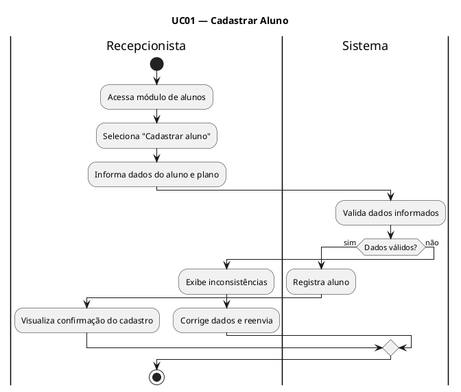

---

## UC02 — Gerenciar Planos

### Ator Principal
Gerente

### Objetivo
Permitir criar, editar, ativar e desativar planos oferecidos pela academia.

### Pré-condições
- Gerente autenticado no sistema.
- Gerente com permissão para configuração de planos.

### Pós-condições
- Plano criado, alterado, ativado ou desativado com sucesso.
- Catálogo de planos atualizado.

### Fluxo Principal
1. O gerente acessa o módulo de planos.
2. O gerente escolhe criar, editar, ativar ou desativar um plano.
3. O sistema apresenta os dados do plano ou um formulário em branco.
4. O gerente informa ou altera os dados do plano.
5. O sistema valida as informações.
6. O sistema salva as alterações.

### Fluxos Alternativos
- **A1 — Dados do plano inválidos:**  
  O sistema informa a inconsistência e não salva as alterações até que os dados sejam corrigidos.

### RF Relacionados
- RF02

### RNF Relacionados
- RNF04
- RNF05

### RN Relacionadas
- RN06

### Diagrama de Atividade (PlantUML)
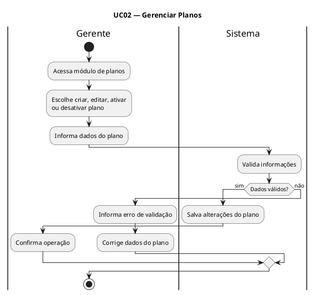

---

## UC03 — Registrar Pagamento

### Ator Principal
Recepcionista

### Objetivo
Registrar o pagamento da mensalidade do aluno e atualizar sua situação financeira.

### Pré-condições
- Recepcionista autenticado no sistema.
- Aluno previamente cadastrado.

### Pós-condições
- Pagamento registrado com sucesso.
- Situação do aluno atualizada imediatamente.

### Fluxo Principal
1. O recepcionista busca o aluno no sistema.
2. O recepcionista seleciona a opção de registrar pagamento.
3. O sistema apresenta os dados da mensalidade em aberto.
4. O recepcionista informa a forma de pagamento e o valor recebido.
5. O sistema valida o valor informado.
6. O sistema registra o pagamento.
7. O sistema atualiza imediatamente a regularidade do aluno.

### Fluxos Alternativos
- **A1 — Pagamento parcial:**  
  O sistema rejeita o lançamento e informa que a mensalidade deve ser paga integralmente.

- **A2 — Aluno não localizado:**  
  O sistema informa que não foi possível localizar o cadastro do aluno.

### RF Relacionados
- RF03
- RF04

### RNF Relacionados
- RNF02
- RNF04

### RN Relacionadas
- RN04
- RN07
- RN06

### Diagrama de Atividade (PlantUML)
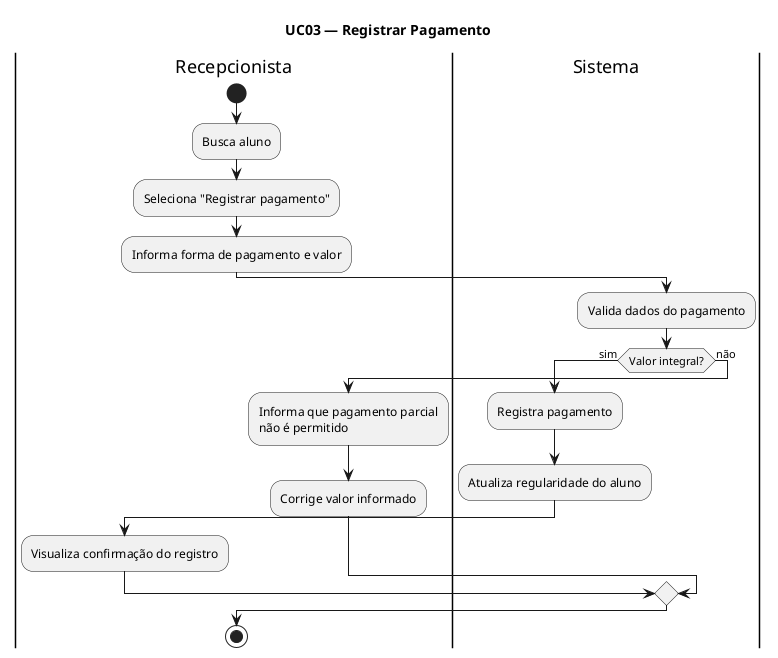

---

## UC04 — Verificar Regularidade do Aluno

### Ator Principal
Sistema

### Objetivo
Verificar automaticamente se o aluno está em situação regular para utilização dos serviços da academia.

### Pré-condições
- Aluno cadastrado no sistema.
- Existência de informações de plano e pagamentos do aluno.

### Pós-condições
- Situação do aluno definida como regular ou irregular.

### Fluxo Principal
1. O sistema localiza o cadastro do aluno.
2. O sistema verifica a data de vencimento da mensalidade.
3. O sistema consulta os pagamentos registrados.
4. O sistema compara a data atual com o vencimento e a tolerância de inadimplência.
5. O sistema define a situação do aluno.

### Fluxos Alternativos
- **A1 — Mensalidade vencida há mais de 5 dias:**  
  O sistema marca o aluno como irregular.

- **A2 — Pagamento confirmado:**  
  O sistema mantém ou define o aluno como regular.

### RF Relacionados
- RF04

### RNF Relacionados
- Nenhum específico.

### RN Relacionadas
- RN01

### Diagrama de Atividade (PlantUML)
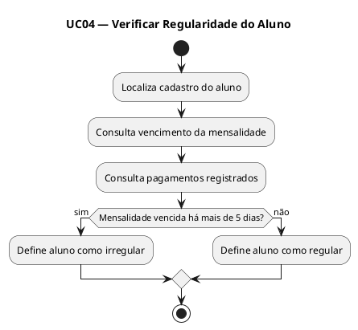

---

## UC05 — Validar Acesso na Catraca

### Ator Principal
Aluno

### Objetivo
Permitir ou bloquear a entrada do aluno na academia com base na leitura do RFID e na sua regularidade.

### Pré-condições
- Aluno cadastrado no sistema.
- Aluno apresenta credencial RFID na catraca.
- Integração entre catraca e sistema disponível.

### Pós-condições
- Acesso autorizado ou bloqueado.
- Tentativa de acesso registrada para consulta posterior.

### Fluxo Principal
1. O aluno aproxima sua credencial RFID da catraca.
2. O sistema de catraca envia a identificação do aluno para a API do FitPass.
3. O sistema verifica a regularidade do aluno.
4. O sistema retorna a resposta de autorização para a catraca.
5. A catraca libera a entrada do aluno.
6. O sistema registra o acesso no histórico.

### Fluxos Alternativos
- **A1 — Aluno inadimplente:**  
  O sistema retorna negativa de acesso e a catraca permanece bloqueada.

- **A2 — Falha de integração:**  
  A catraca não recebe resposta válida e a entrada é negada até nova tentativa.

### RF Relacionados
- RF05
- RF04
- RF09

### RNF Relacionados
- RNF03
- RNF06

### RN Relacionadas
- RN01

### Diagrama de Atividade (PlantUML)
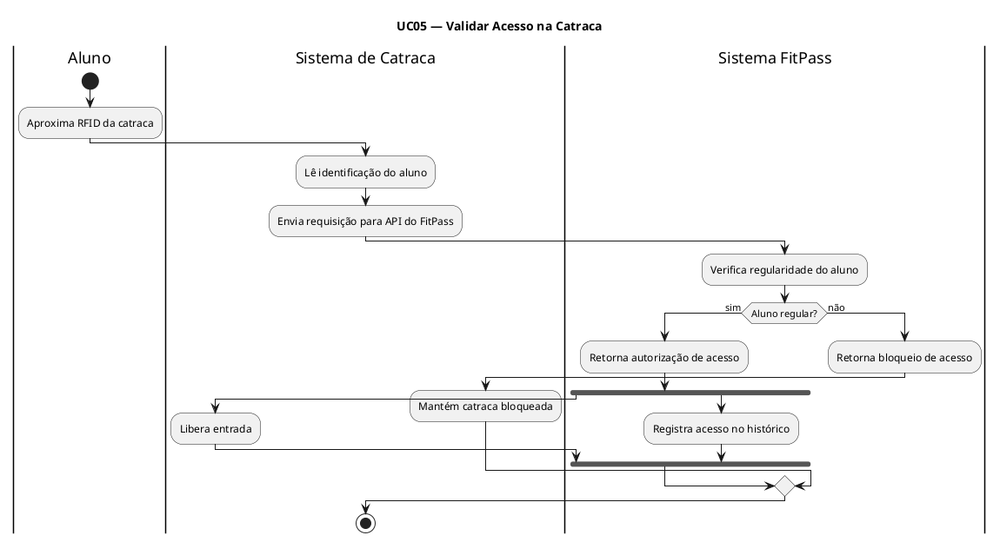

---

## UC06 — Consultar Horários de Aula

### Ator Principal
Aluno

### Objetivo
Permitir ao aluno visualizar os horários e as aulas disponíveis para agendamento.

### Pré-condições
- Aluno autenticado no sistema.

### Pós-condições
- Lista de aulas e horários exibida ao aluno.

### Fluxo Principal
1. O aluno acessa a agenda de aulas.
2. O sistema consulta as aulas disponíveis.
3. O sistema exibe os horários, instrutores e disponibilidade de vagas.

### Fluxos Alternativos
- **A1 — Não há aulas disponíveis:**  
  O sistema informa que não existem aulas disponíveis para o período consultado.

### RF Relacionados
- RF06

### RNF Relacionados
- RNF04

### RN Relacionadas
- Nenhuma específica.

### Diagrama de Atividade (PlantUML)
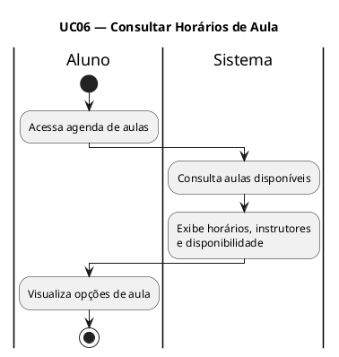

---

## UC07 — Agendar Aula

### Ator Principal
Aluno

### Objetivo
Permitir ao aluno reservar vaga em uma aula disponível.

### Pré-condições
- Aluno autenticado no sistema.
- Aula disponível para agendamento.

### Pós-condições
- Reserva registrada com sucesso.
- Confirmação de agendamento enviada ao aluno.

### Fluxo Principal
1. O aluno acessa a agenda de aulas.
2. O aluno seleciona a aula desejada.
3. O sistema verifica a disponibilidade de vagas.
4. O sistema registra a reserva para o aluno.
5. O sistema atualiza a ocupação da aula.
6. O sistema envia a confirmação de agendamento ao aluno.

### Fluxos Alternativos
- **A1 — Aula lotada:**  
  O sistema informa que não há vagas disponíveis para a aula selecionada.

- **A2 — Aula indisponível:**  
  O sistema informa que a aula não pode mais ser reservada.

### RF Relacionados
- RF06
- RF10
- RF09

### RNF Relacionados
- RNF04

### RN Relacionadas
- RN02

### Diagrama de Atividade (PlantUML)
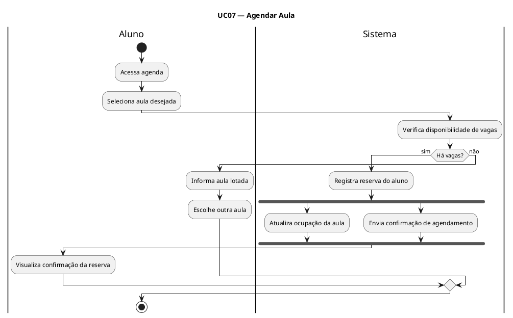

---

## UC08 — Cancelar Agendamento

### Ator Principal
Aluno

### Objetivo
Permitir ao aluno cancelar uma reserva de aula dentro do prazo permitido.

### Pré-condições
- Aluno autenticado no sistema.
- Reserva previamente registrada para o aluno.

### Pós-condições
- Reserva cancelada com sucesso e vaga liberada, quando o prazo for válido.

### Fluxo Principal
1. O aluno acessa a lista de reservas.
2. O aluno seleciona a reserva que deseja cancelar.
3. O sistema valida o prazo para cancelamento.
4. O sistema efetiva o cancelamento da reserva.
5. O sistema libera a vaga na aula.

### Fluxos Alternativos
- **A1 — Prazo excedido:**  
  O sistema informa que o cancelamento só pode ser realizado até 1 hora antes do início da aula.

- **A2 — Reserva inexistente:**  
  O sistema informa que a reserva selecionada não foi localizada.

### RF Relacionados
- RF06

### RNF Relacionados
- RNF04

### RN Relacionadas
- RN03

### Diagrama de Atividade (PlantUML)
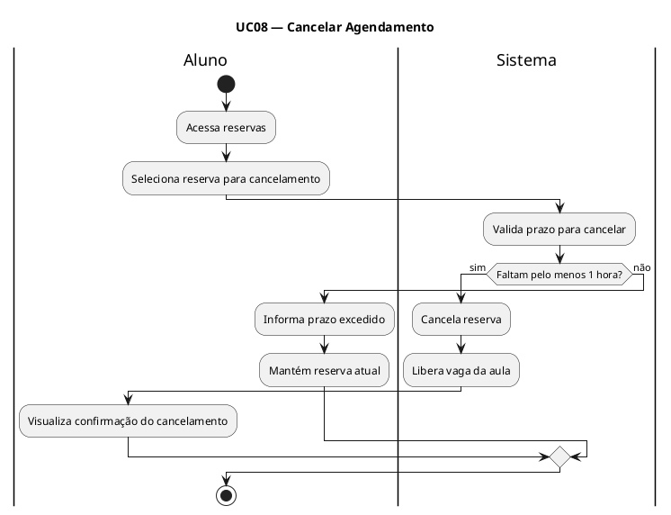

---

## UC09 — Registrar Presença em Aula

### Ator Principal
Instrutor

### Objetivo
Permitir ao instrutor registrar a presença dos alunos em uma aula.

### Pré-condições
- Instrutor autenticado no sistema.
- Aula disponível para registro de presença.

### Pós-condições
- Presenças registradas para a aula selecionada.

### Fluxo Principal
1. O instrutor acessa a aula do período.
2. O sistema exibe a lista de alunos agendados.
3. O instrutor marca a presença dos alunos.
4. O sistema salva o registro da presença.

### Fluxos Alternativos
- **A1 — Lista indisponível:**  
  O sistema informa que a lista de alunos da aula não pôde ser carregada.

### RF Relacionados
- RF07

### RNF Relacionados
- RNF04

### RN Relacionadas
- RN06

### Diagrama de Atividade (PlantUML)
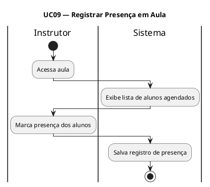

---

## UC10 — Registrar Avaliação Física

### Ator Principal
Instrutor

### Objetivo
Permitir ao instrutor registrar uma avaliação física do aluno apto para o procedimento.

### Pré-condições
- Instrutor autenticado no sistema.
- Aluno cadastrado e identificado no sistema.

### Pós-condições
- Avaliação física registrada com sucesso.
- Aluno notificado sobre a nova avaliação física.

### Fluxo Principal
1. O instrutor seleciona o aluno.
2. O sistema verifica a situação do aluno.
3. O instrutor informa os dados da avaliação física.
4. O sistema salva a avaliação.
5. O sistema notifica o aluno sobre a nova avaliação.

### Fluxos Alternativos
- **A1 — Aluno irregular:**  
  O sistema informa que apenas alunos ativos e regulares podem realizar avaliação física.

- **A2 — Dados incompletos:**  
  O sistema informa inconsistências e solicita a correção da avaliação antes do salvamento.

### RF Relacionados
- RF08
- RF10

### RNF Relacionados
- RNF02
- RNF04

### RN Relacionadas
- RN05
- RN06

### Diagrama de Atividade (PlantUML)
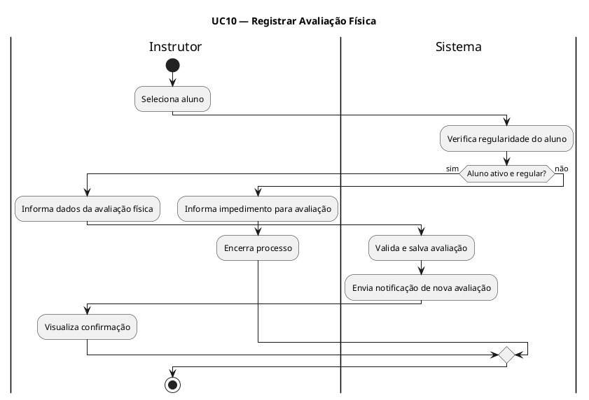

---

## UC11 — Anexar Arquivo de Avaliação

### Ator Principal
Instrutor

### Objetivo
Permitir anexar um arquivo complementar a uma avaliação física do aluno.

### Pré-condições
- Instrutor autenticado no sistema.
- Avaliação física previamente selecionada.

### Pós-condições
- Arquivo anexado e armazenado com segurança.

### Fluxo Principal
1. O instrutor acessa a avaliação física do aluno.
2. O instrutor seleciona a opção de anexar arquivo.
3. O sistema solicita o envio do arquivo.
4. O instrutor seleciona o arquivo desejado.
5. O sistema armazena o arquivo de forma segura e o vincula à avaliação.

### Fluxos Alternativos
- **A1 — Falha no envio:**  
  O sistema informa que não foi possível concluir o upload do arquivo.

- **A2 — Avaliação não selecionada:**  
  O sistema informa que é necessário escolher uma avaliação antes de anexar o arquivo.

### RF Relacionados
- RF08

### RNF Relacionados
- RNF02

### RN Relacionadas
- RN06

### Diagrama de Atividade (PlantUML)
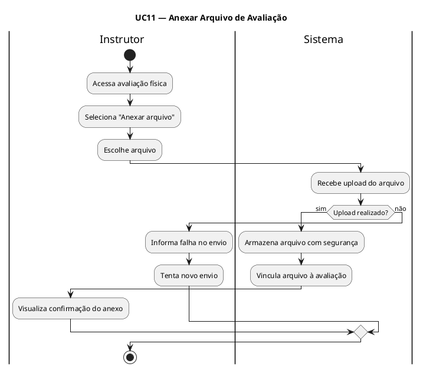

---

## UC12 — Emitir Relatório de Inadimplência

### Ator Principal
Gerente

### Objetivo
Permitir ao gerente emitir relatório com os alunos inadimplentes.

### Pré-condições
- Gerente autenticado no sistema.

### Pós-condições
- Relatório de inadimplência gerado e exibido.

### Fluxo Principal
1. O gerente acessa o módulo de relatórios.
2. O gerente seleciona o relatório de inadimplência.
3. O sistema consulta os alunos em situação irregular.
4. O sistema gera o relatório.
5. O sistema exibe o resultado ao gerente.

### Fluxos Alternativos
- **A1 — Não há inadimplentes:**  
  O sistema informa que não existem alunos inadimplentes para os filtros informados.

### RF Relacionados
- RF09

### RNF Relacionados
- RNF04
- RNF05

### RN Relacionadas
- RN06
- RN01

### Diagrama de Atividade (PlantUML)
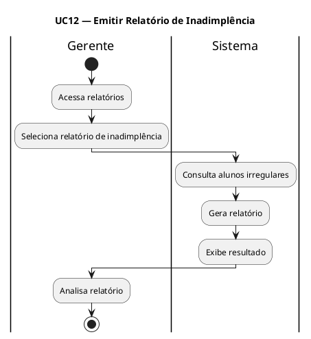

---

## UC13 — Emitir Relatório de Alunos Ativos

### Ator Principal
Gerente

### Objetivo
Permitir ao gerente emitir relatório com os alunos ativos no sistema.

### Pré-condições
- Gerente autenticado no sistema.

### Pós-condições
- Relatório de alunos ativos gerado e exibido.

### Fluxo Principal
1. O gerente acessa o módulo de relatórios.
2. O gerente seleciona o relatório de alunos ativos.
3. O sistema consulta os alunos ativos.
4. O sistema gera o relatório.
5. O sistema exibe o resultado ao gerente.

### Fluxos Alternativos
- **A1 — Nenhum aluno ativo encontrado:**  
  O sistema informa que não há alunos ativos para o filtro selecionado.

### RF Relacionados
- RF09

### RNF Relacionados
- RNF04
- RNF05

### RN Relacionadas
- RN06

### Diagrama de Atividade (PlantUML)
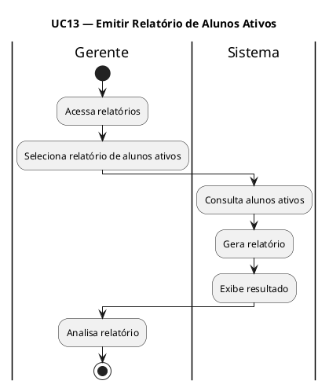

---

## UC14 — Emitir Relatório de Acessos

### Ator Principal
Gerente

### Objetivo
Permitir ao gerente emitir relatório com o histórico de acessos dos alunos.

### Pré-condições
- Gerente autenticado no sistema.
- Existência de registros de acesso.

### Pós-condições
- Relatório de acessos gerado e exibido.

### Fluxo Principal
1. O gerente acessa o módulo de relatórios.
2. O gerente seleciona o relatório de acessos.
3. O sistema consulta o histórico de acessos.
4. O sistema gera o relatório.
5. O sistema exibe o resultado ao gerente.

### Fluxos Alternativos
- **A1 — Sem registros de acesso:**  
  O sistema informa que não há registros de acesso para o período consultado.

### RF Relacionados
- RF09

### RNF Relacionados
- RNF04
- RNF05

### RN Relacionadas
- RN06

### Diagrama de Atividade (PlantUML)
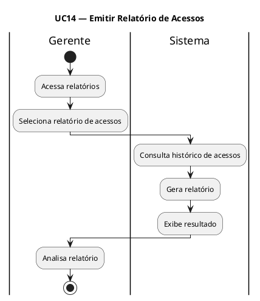

---

## UC15 — Emitir Relatório de Ocupação de Aulas

### Ator Principal
Gerente

### Objetivo
Permitir ao gerente emitir relatório com a ocupação das aulas em determinado período.

### Pré-condições
- Gerente autenticado no sistema.

### Pós-condições
- Relatório de ocupação de aulas gerado e exibido.

### Fluxo Principal
1. O gerente acessa o módulo de relatórios.
2. O gerente seleciona o relatório de ocupação de aulas.
3. O gerente informa o período desejado.
4. O sistema consulta os dados de ocupação das aulas.
5. O sistema gera o relatório.
6. O sistema exibe o resultado ao gerente.

### Fluxos Alternativos
- **A1 — Período inválido:**  
  O sistema informa que o período selecionado é inválido.

- **A2 — Sem dados no período:**  
  O sistema informa que não existem dados de ocupação para o período consultado.

### RF Relacionados
- RF09

### RNF Relacionados
- RNF04
- RNF05

### RN Relacionadas
- RN06

### Diagrama de Atividade (PlantUML)
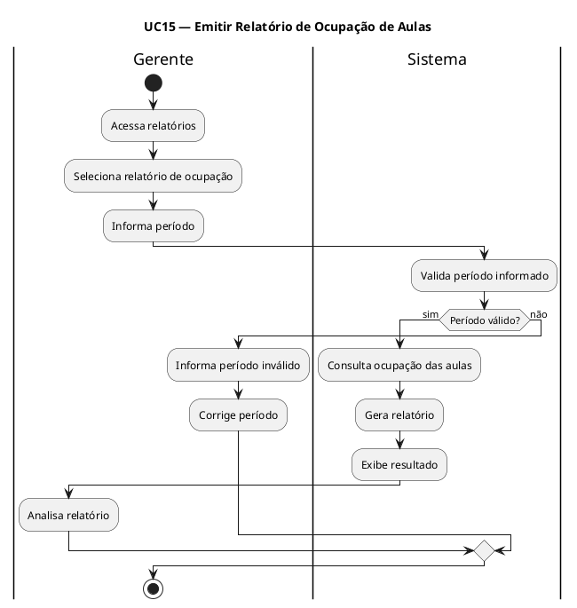

---

## UC16 — Enviar Notificação de Vencimento

### Ator Principal
Sistema

### Objetivo
Enviar notificações aos alunos com mensalidade próxima do vencimento.

### Pré-condições
- Existência de alunos com mensalidade próxima do vencimento.
- Serviço de notificação disponível.

### Pós-condições
- Notificações de vencimento enviadas aos alunos elegíveis.

### Fluxo Principal
1. O sistema identifica as mensalidades próximas do vencimento.
2. O sistema seleciona os alunos correspondentes.
3. O sistema monta a mensagem de notificação.
4. O sistema envia a notificação ao aluno.

### Fluxos Alternativos
- **A1 — Nenhum vencimento próximo:**  
  O sistema encerra o processo sem envio de notificações.

- **A2 — Falha no envio:**  
  O sistema registra a falha para nova tentativa posterior.

### RF Relacionados
- RF10

### RNF Relacionados
- RNF01

### RN Relacionadas
- Nenhuma específica.

### Diagrama de Atividade (PlantUML)
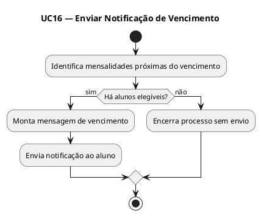

---

## UC17 — Enviar Confirmação de Agendamento

### Ator Principal
Sistema

### Objetivo
Enviar a confirmação de agendamento ao aluno após a reserva de uma aula.

### Pré-condições
- Reserva de aula registrada com sucesso.
- Serviço de notificação disponível.

### Pós-condições
- Confirmação de agendamento enviada ao aluno.

### Fluxo Principal
1. O sistema recebe o evento de reserva confirmada.
2. O sistema prepara a mensagem de confirmação.
3. O sistema envia a notificação ao aluno.

### Fluxos Alternativos
- **A1 — Falha no envio:**  
  O sistema registra a falha para reenvio posterior.

### RF Relacionados
- RF10

### RNF Relacionados
- RNF01

### RN Relacionadas
- Nenhuma específica.

### Diagrama de Atividade (PlantUML)
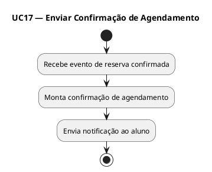

---

## UC18 — Notificar Nova Avaliação Física

### Ator Principal
Sistema

### Objetivo
Notificar o aluno quando uma nova avaliação física estiver disponível.

### Pré-condições
- Nova avaliação física registrada para o aluno.
- Serviço de notificação disponível.

### Pós-condições
- Notificação de nova avaliação enviada ao aluno.

### Fluxo Principal
1. O sistema identifica que uma nova avaliação física foi registrada.
2. O sistema monta a mensagem de notificação.
3. O sistema envia a notificação ao aluno.

### Fluxos Alternativos
- **A1 — Falha no envio:**  
  O sistema registra a falha para tentativa posterior.

### RF Relacionados
- RF10

### RNF Relacionados
- RNF01

### RN Relacionadas
- Nenhuma específica.

### Diagrama de Atividade (PlantUML)
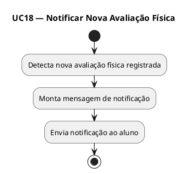

---

## UC19 — Atualizar Regularidade

### Ator Principal
Sistema

### Objetivo
Atualizar automaticamente a situação do aluno após o registro de um pagamento.

### Pré-condições
- Pagamento registrado com sucesso.
- Aluno identificado no sistema.

### Pós-condições
- Situação do aluno atualizada imediatamente.

### Fluxo Principal
1. O sistema recebe a confirmação do pagamento registrado.
2. O sistema consulta a situação atual do aluno.
3. O sistema atualiza a regularidade do aluno.
4. O sistema disponibiliza a situação atualizada para os demais processos.

### Fluxos Alternativos
- **A1 — Falha na atualização:**  
  O sistema registra inconsistência e mantém o caso pendente para correção.

### RF Relacionados
- RF04

### RNF Relacionados
- Nenhum específico.

### RN Relacionadas
- RN07

### Diagrama de Atividade (PlantUML)
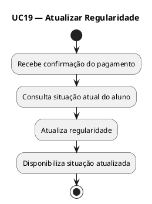

---

## UC20 — Autenticar Usuário

### Ator Principal
Usuário interno (Recepcionista, Instrutor ou Gerente)

### Objetivo
Permitir o acesso ao sistema de acordo com o perfil do usuário interno.

### Pré-condições
- Usuário cadastrado e ativo no sistema.

### Pós-condições
- Sessão iniciada com sucesso e permissões definidas conforme o perfil.

### Fluxo Principal
1. O usuário informa login e senha.
2. O sistema valida as credenciais informadas.
3. O sistema identifica o perfil do usuário.
4. O sistema libera o acesso às funcionalidades compatíveis com o perfil.

### Fluxos Alternativos
- **A1 — Credenciais inválidas:**  
  O sistema informa erro de autenticação e não libera o acesso.

- **A2 — Perfil sem permissão para a funcionalidade:**  
  O sistema restringe o acesso aos módulos não autorizados.

### RF Relacionados
- Nenhum RF específico do repositório.

### RNF Relacionados
- RNF02
- RNF04

### RN Relacionadas
- RN06

### Diagrama de Atividade (PlantUML)
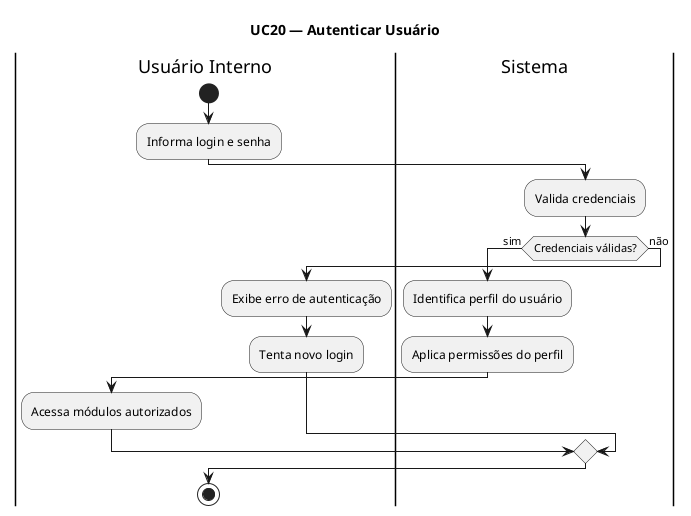

---
