# Documento de Casos de Uso e Diagramas de Atividade  
Disciplina: Engenharia de Software  
Aluno: Paulo Henrique Teixeira  
RA: 24000884
---

# Introdução
Este documento apresenta a modelagem de 20 casos de uso do sistema FitPass, conforme definido na atividade anterior.

Para cada caso de uso, são apresentados:
- Nome  
- Ator principal  
- Descrição  
- Diagrama de atividade correspondente  

---

# Casos de Uso e Diagramas de Atividade

---

## 1. Cadastrar Aluno
Ator: Recepcionista  
Descrição: Permite cadastrar um novo aluno no sistema.

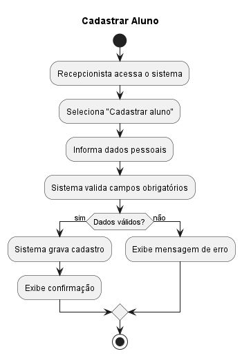

---

## 2. Realizar Matrícula
Ator: Recepcionista  
Descrição: Permite matricular um aluno em um plano.

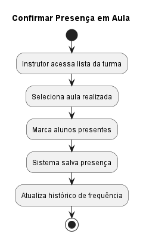

---

## 3. Consultar Planos
Ator: Aluno / Recepcionista  
Descrição: Permite visualizar os planos disponíveis.

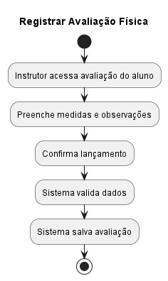

---

## 4. Contratar Plano
Ator: Aluno  
Descrição: Permite contratar um plano disponível.

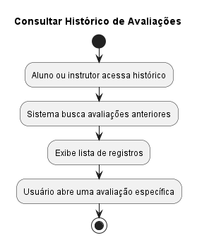

---

## 5. Efetuar Pagamento
Ator: Aluno / Recepcionista  
Descrição: Permite realizar o pagamento de mensalidades.

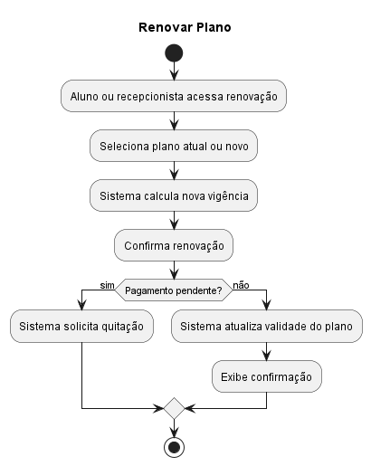

---

## 6. Registrar Entrada na Catraca
Ator: Sistema de Catraca  
Descrição: Registra a entrada do aluno na academia.

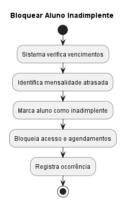

---

## 7. Registrar Saída na Catraca
Ator: Sistema de Catraca  
Descrição: Registra a saída do aluno da academia.

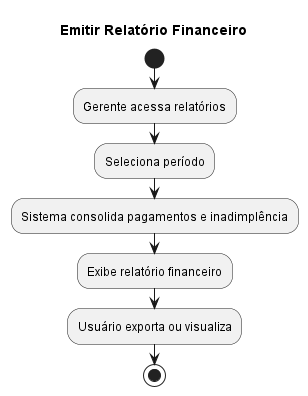

---

## 8. Agendar Aula
Ator: Aluno  
Descrição: Permite agendar participação em uma aula.

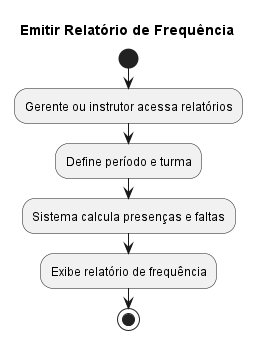

---

## 9. Cancelar Agendamento
Ator: Aluno  
Descrição: Permite cancelar um agendamento de aula.

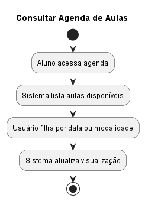

---

## 10. Confirmar Presença em Aula
Ator: Instrutor  
Descrição: Permite registrar a presença dos alunos em aula.

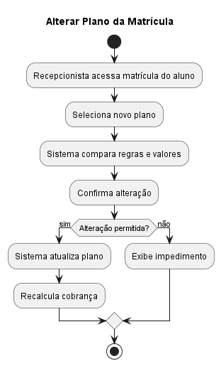

---

## 11. Registrar Avaliação Física
Ator: Instrutor  
Descrição: Permite registrar uma avaliação física do aluno.

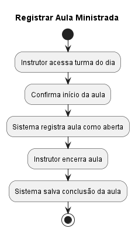

---

## 12. Consultar Histórico de Avaliações
Ator: Aluno / Instrutor  
Descrição: Permite consultar avaliações físicas anteriores.

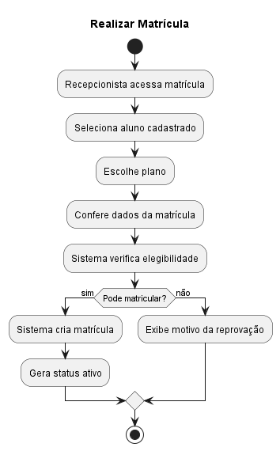

---

## 13. Renovar Plano
Ator: Aluno / Recepcionista  
Descrição: Permite renovar um plano existente.

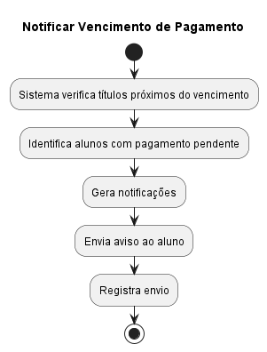

---

## 14. Bloquear Aluno Inadimplente
Ator: Sistema  
Descrição: Bloqueia alunos com pendências financeiras.

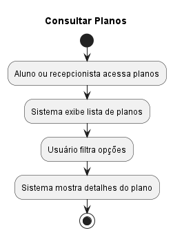

---

## 15. Emitir Relatório Financeiro
Ator: Gerente  
Descrição: Gera relatório financeiro da academia.

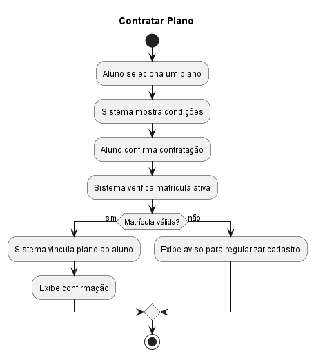

---

## 16. Emitir Relatório de Frequência
Ator: Gerente / Instrutor  
Descrição: Gera relatório de frequência dos alunos.

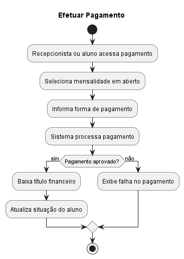

---

## 17. Consultar Agenda de Aulas
Ator: Aluno  
Descrição: Permite visualizar a agenda de aulas disponíveis.

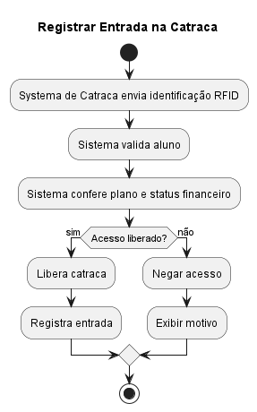

---

## 18. Alterar Plano da Matrícula
Ator: Recepcionista  
Descrição: Permite alterar o plano de um aluno.

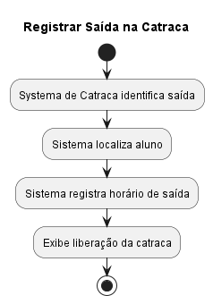

---

## 19. Registrar Aula Ministrada
Ator: Instrutor  
Descrição: Registra a realização de uma aula.

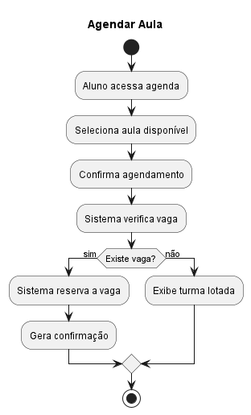

---

## 20. Notificar Vencimento de Pagamento
Ator: Sistema  
Descrição: Notifica alunos sobre vencimentos próximos.

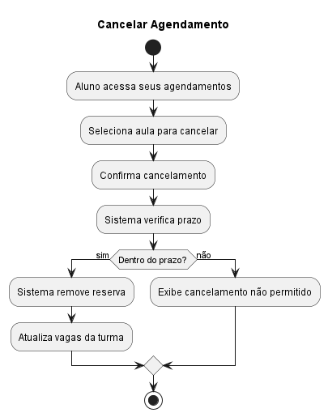
