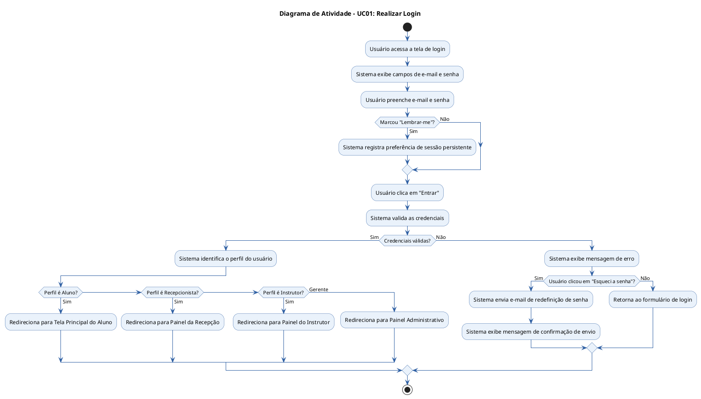
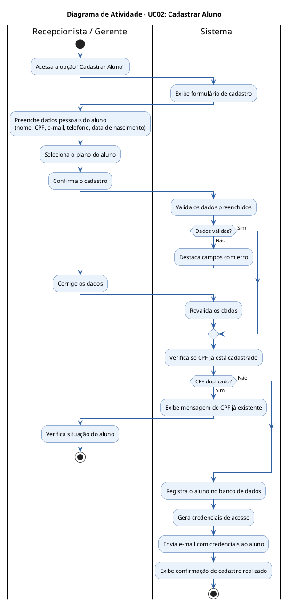
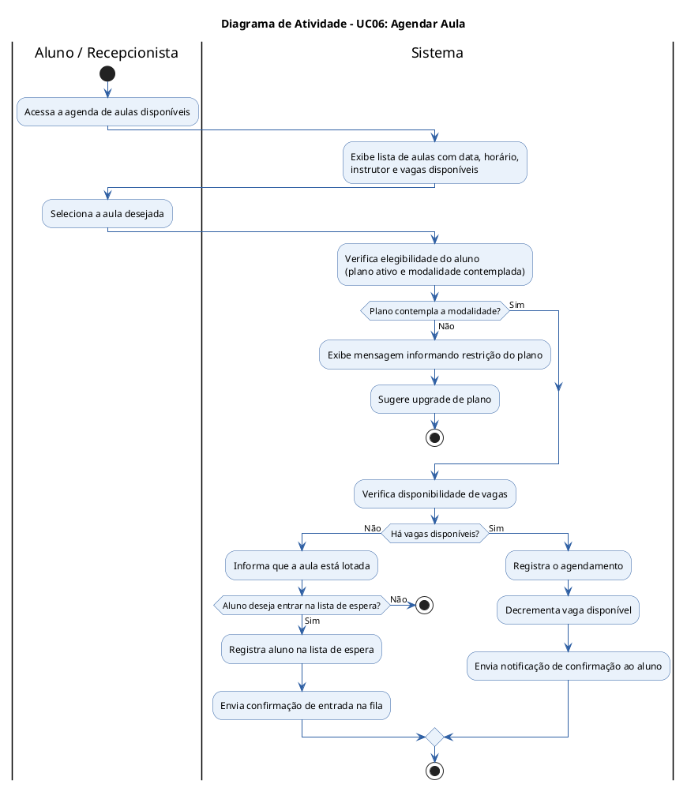
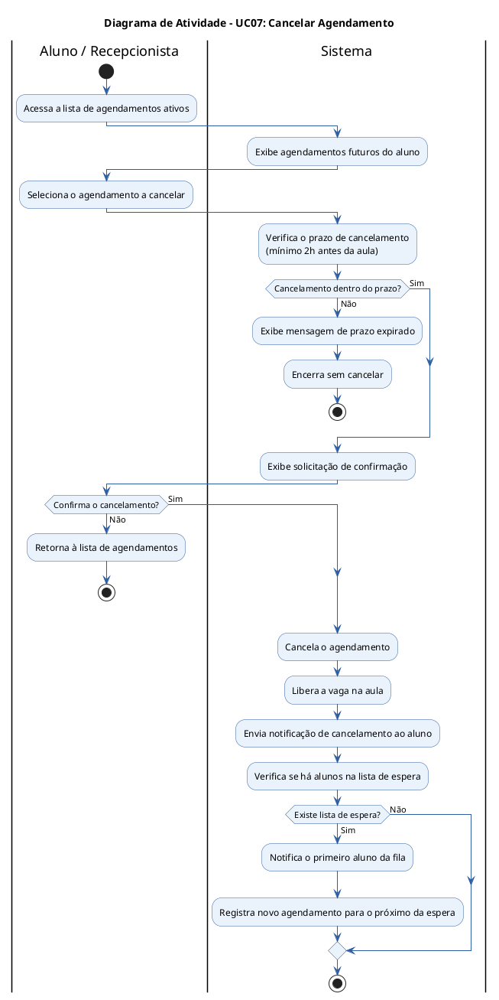
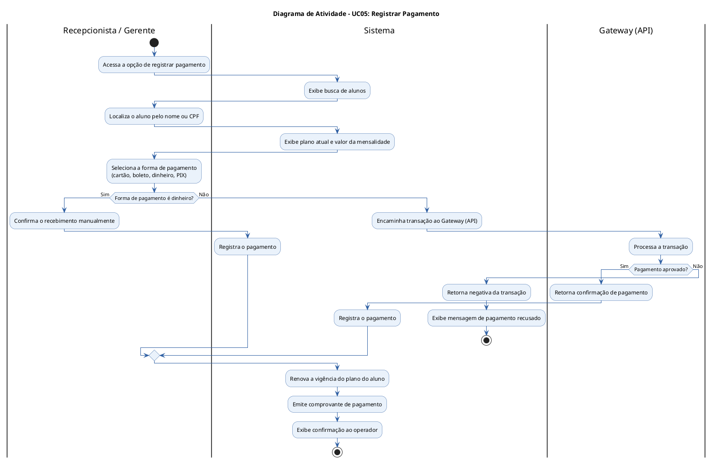
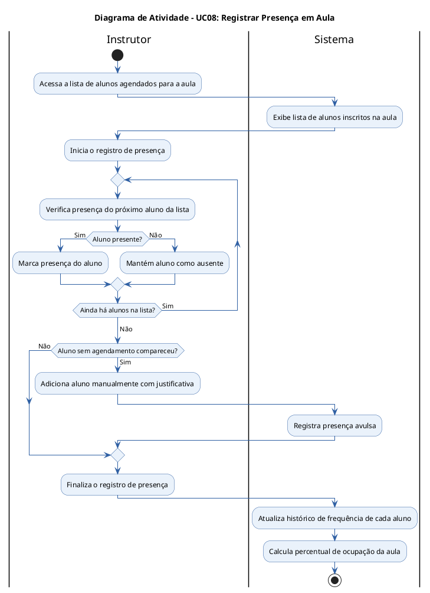
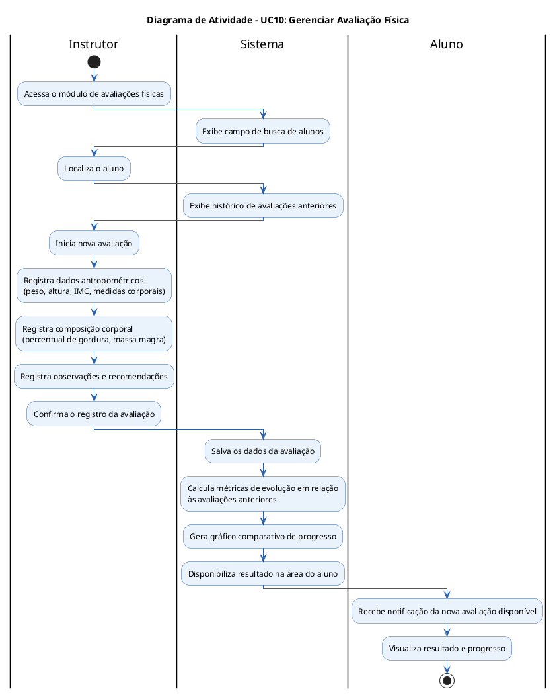

# FitPass Gym Management – Documentação de Casos de Uso e Diagramas de Atividade

**Aluno:** Renan Augusto Cristi Avelar 
**Disciplina:** Engenharia de Software 
**Curso:** Ciência da Computação 
**Sistema:** FitPass Gym Management 

---

## Sumário

1. [Diagrama de Casos de Uso](#1-diagrama-de-casos-de-uso)
2. [Documentação dos Casos de Uso](#2-documentação-dos-casos-de-uso)
   - [UC01 – Realizar Login](#uc01--realizar-login)
   - [UC02 – Cadastrar Aluno](#uc02--cadastrar-aluno)
   - [UC03 – Editar Dados do Aluno](#uc03--editar-dados-do-aluno)
   - [UC04 – Gerenciar Planos](#uc04--gerenciar-planos)
   - [UC05 – Registrar Pagamento](#uc05--registrar-pagamento)
   - [UC06 – Agendar Aula](#uc06--agendar-aula)
   - [UC07 – Cancelar Agendamento](#uc07--cancelar-agendamento)
   - [UC08 – Registrar Presença em Aula](#uc08--registrar-presença-em-aula)
   - [UC09 – Gerar Relatórios](#uc09--gerar-relatórios)
   - [UC10 – Gerenciar Avaliação Física](#uc10--gerenciar-avaliação-física)
3. [Diagramas de Atividade](#3-diagramas-de-atividade)

---

## 1. Diagrama de Casos de Uso

> O diagrama abaixo representa o sistema FitPass Gym Management com seus atores e casos de uso identificados.

**Atores identificados:**

| Ator | Descrição |
|------|-----------|
| **Aluno** | Usuário que utiliza os serviços da academia |
| **Recepcionista** | Funcionário responsável pelo atendimento e cadastros |
| **Instrutor** | Profissional que ministra aulas e avalia alunos |
| **Gerente** | Administrador do sistema com acesso total |
| **Sistema Serviço** | Serviço interno que processa regras de negócio automatizadas |
| **Gateway (API)** | Sistema externo para processamento de pagamentos |

---

## 2. Documentação dos Casos de Uso

---

### UC01 – Realizar Login

| Campo | Descrição |
|-------|-----------|
| **Identificador** | UC01 |
| **Nome** | Realizar Login |
| **Atores** | Aluno, Recepcionista, Instrutor, Gerente |
| **Pré-condição** | O usuário deve estar cadastrado no sistema |
| **Pós-condição** | O usuário é autenticado e redirecionado para a tela principal |
| **Prioridade** | Alta |

**Fluxo Principal:**

1. O usuário acessa a tela de login do aplicativo
2. O sistema exibe os campos de e-mail e senha
3. O usuário preenche o e-mail
4. O usuário preenche a senha
5. O usuário clica no botão "Entrar"
6. O sistema valida as credenciais
7. O sistema redireciona o usuário para a tela principal correspondente ao seu perfil

**Fluxos Alternativos:**

- **FA01 – Credenciais inválidas:** No passo 6, se as credenciais estiverem incorretas, o sistema exibe mensagem de erro e retorna ao passo 3.
- **FA02 – Esqueci a senha:** No passo 4, o usuário pode clicar em "Esqueci a senha" e o sistema envia um e-mail de redefinição.
- **FA03 – Lembrar-me:** O usuário pode marcar a opção "Lembrar-me" para manter a sessão ativa.

**Exceções:**

- **EX01:** Se o servidor estiver indisponível, o sistema exibe mensagem de erro de conexão.

---

### UC02 – Cadastrar Aluno

| Campo | Descrição |
|-------|-----------|
| **Identificador** | UC02 |
| **Nome** | Cadastrar Aluno |
| **Atores** | Recepcionista, Gerente |
| **Pré-condição** | O ator deve estar autenticado com perfil de Recepcionista ou Gerente |
| **Pós-condição** | O aluno é cadastrado no sistema e recebe credenciais de acesso |
| **Prioridade** | Alta |

**Fluxo Principal:**

1. O ator acessa a opção "Cadastrar Aluno"
2. O sistema exibe o formulário de cadastro
3. O ator preenche os dados pessoais (nome, CPF, e-mail, telefone, data de nascimento)
4. O ator seleciona o plano do aluno
5. O ator confirma o cadastro
6. O sistema valida os dados
7. O sistema registra o aluno e envia as credenciais de acesso por e-mail
8. O sistema exibe confirmação de cadastro realizado

**Fluxos Alternativos:**

- **FA01 – CPF já cadastrado:** No passo 6, o sistema informa que o CPF já está em uso e retorna ao formulário.
- **FA02 – E-mail já cadastrado:** Comportamento similar ao FA01 para e-mail duplicado.

**Exceções:**

- **EX01:** Falha no envio do e-mail de credenciais; o sistema registra o aluno e notifica o operador para reenvio manual.

---

### UC03 – Editar Dados do Aluno

| Campo | Descrição |
|-------|-----------|
| **Identificador** | UC03 |
| **Nome** | Editar Dados do Aluno |
| **Atores** | Aluno, Recepcionista, Gerente |
| **Pré-condição** | O aluno deve estar cadastrado no sistema |
| **Pós-condição** | Os dados do aluno são atualizados no sistema |
| **Prioridade** | Média |

**Fluxo Principal:**

1. O ator acessa a tela de perfil ou busca o aluno pelo sistema
2. O sistema exibe os dados atuais do aluno
3. O ator seleciona o campo a ser editado
4. O ator altera as informações desejadas
5. O ator confirma as alterações
6. O sistema valida os novos dados
7. O sistema salva as alterações e exibe confirmação

**Fluxos Alternativos:**

- **FA01 – Dados inválidos:** No passo 6, o sistema indica os campos com erro e solicita correção.
- **FA02 – Cancelar edição:** O ator pode cancelar em qualquer momento, descartando as alterações.

---

### UC04 – Gerenciar Planos

| Campo | Descrição |
|-------|-----------|
| **Identificador** | UC04 |
| **Nome** | Gerenciar Planos |
| **Atores** | Gerente |
| **Pré-condição** | O gerente deve estar autenticado |
| **Pós-condição** | O plano é criado, editado ou desativado no sistema |
| **Prioridade** | Média |

**Fluxo Principal:**

1. O gerente acessa o módulo de planos
2. O sistema lista os planos existentes
3. O gerente seleciona a ação desejada (criar, editar ou desativar)
4. O sistema exibe o formulário correspondente
5. O gerente preenche ou altera os dados (nome, valor, duração, benefícios)
6. O gerente confirma a operação
7. O sistema salva as alterações e atualiza a listagem

**Fluxos Alternativos:**

- **FA01 – Desativar plano com alunos vinculados:** O sistema alerta que existem alunos ativos naquele plano e solicita confirmação antes de prosseguir.

---

### UC05 – Registrar Pagamento

| Campo | Descrição |
|-------|-----------|
| **Identificador** | UC05 |
| **Nome** | Registrar Pagamento |
| **Atores** | Recepcionista, Gerente, Gateway (API) |
| **Pré-condição** | O aluno deve estar cadastrado e com plano ativo |
| **Pós-condição** | O pagamento é registrado e o plano do aluno é renovado |
| **Prioridade** | Alta |

**Fluxo Principal:**

1. O ator acessa a opção de registrar pagamento
2. O sistema exibe a busca de alunos
3. O ator localiza o aluno
4. O sistema exibe o plano atual e o valor da mensalidade
5. O ator seleciona a forma de pagamento
6. O sistema encaminha a transação ao Gateway (API)
7. O Gateway processa e retorna confirmação
8. O sistema registra o pagamento e renova a vigência do plano
9. O sistema emite comprovante

**Fluxos Alternativos:**

- **FA01 – Pagamento recusado:** No passo 7, o Gateway retorna negativa; o sistema informa o ator e não registra o pagamento.
- **FA02 – Pagamento em dinheiro:** O fluxo não aciona o Gateway; o ator confirma o recebimento manualmente.

---

### UC06 – Agendar Aula

| Campo | Descrição |
|-------|-----------|
| **Identificador** | UC06 |
| **Nome** | Agendar Aula |
| **Atores** | Aluno, Recepcionista |
| **Pré-condição** | O aluno deve ter plano ativo que inclua a modalidade desejada |
| **Pós-condição** | O aluno é inscrito na aula e recebe confirmação |
| **Prioridade** | Alta |

**Fluxo Principal:**

1. O ator acessa a agenda de aulas disponíveis
2. O sistema exibe as aulas com data, horário, instrutor e vagas disponíveis
3. O ator seleciona a aula desejada
4. O sistema verifica a disponibilidade de vagas e elegibilidade do aluno
5. O sistema registra o agendamento
6. O sistema envia notificação de confirmação ao aluno

**Fluxos Alternativos:**

- **FA01 – Sem vagas disponíveis:** No passo 4, o sistema informa que a aula está lotada e oferece a opção de entrar na lista de espera.
- **FA02 – Plano não contempla a modalidade:** O sistema exibe mensagem e sugere upgrade de plano.

---

### UC07 – Cancelar Agendamento

| Campo | Descrição |
|-------|-----------|
| **Identificador** | UC07 |
| **Nome** | Cancelar Agendamento |
| **Atores** | Aluno, Recepcionista |
| **Pré-condição** | O aluno deve ter um agendamento ativo |
| **Pós-condição** | O agendamento é cancelado e a vaga liberada |
| **Prioridade** | Média |

**Fluxo Principal:**

1. O ator acessa seus agendamentos
2. O sistema lista as aulas agendadas
3. O ator seleciona o agendamento a ser cancelado
4. O sistema verifica o prazo de cancelamento (mínimo 2h antes da aula)
5. O sistema solicita confirmação do cancelamento
6. O ator confirma
7. O sistema cancela o agendamento, libera a vaga e notifica o aluno

**Fluxos Alternativos:**

- **FA01 – Fora do prazo de cancelamento:** No passo 4, o sistema informa que o cancelamento não é permitido fora do prazo e encerra o fluxo.
- **FA02 – Existe lista de espera:** Após o cancelamento, o sistema notifica automaticamente o primeiro aluno da fila de espera.

---

### UC08 – Registrar Presença em Aula

| Campo | Descrição |
|-------|-----------|
| **Identificador** | UC08 |
| **Nome** | Registrar Presença em Aula |
| **Atores** | Instrutor, Recepcionista, Sistema Serviço |
| **Pré-condição** | A aula deve ter sido iniciada |
| **Pós-condição** | A presença do aluno é registrada no histórico |
| **Prioridade** | Média |

**Fluxo Principal:**

1. O instrutor acessa a lista de alunos agendados para a aula
2. O sistema exibe a lista com os nomes dos alunos
3. O instrutor marca a presença de cada aluno presente
4. O sistema registra as presenças
5. O instrutor finaliza o registro
6. O sistema atualiza o histórico de frequência de cada aluno

**Fluxos Alternativos:**

- **FA01 – Aluno sem agendamento:** O instrutor pode adicionar manualmente um aluno que compareça sem agendamento prévio, mediante confirmação.

---

### UC09 – Gerar Relatórios

| Campo | Descrição |
|-------|-----------|
| **Identificador** | UC09 |
| **Nome** | Gerar Relatórios |
| **Atores** | Gerente |
| **Pré-condição** | O gerente deve estar autenticado |
| **Pós-condição** | O relatório é gerado e disponibilizado para visualização ou exportação |
| **Prioridade** | Média |

**Fluxo Principal:**

1. O gerente acessa o módulo de relatórios
2. O sistema exibe os tipos de relatório disponíveis (financeiro, frequência, matrículas)
3. O gerente seleciona o tipo de relatório e o período
4. O sistema processa os dados
5. O sistema exibe o relatório consolidado
6. O gerente pode exportar o relatório em PDF ou planilha

---

### UC10 – Gerenciar Avaliação Física

| Campo | Descrição |
|-------|-----------|
| **Identificador** | UC10 |
| **Nome** | Gerenciar Avaliação Física |
| **Atores** | Instrutor, Aluno |
| **Pré-condição** | O aluno deve estar cadastrado e o instrutor autenticado |
| **Pós-condição** | A avaliação é registrada e disponibilizada ao aluno |
| **Prioridade** | Média |

**Fluxo Principal:**

1. O instrutor acessa o módulo de avaliações
2. O instrutor localiza o aluno
3. O sistema exibe o histórico de avaliações anteriores
4. O instrutor registra os novos dados da avaliação (peso, medidas, composição corporal)
5. O sistema salva a avaliação e calcula métricas de evolução
6. O sistema disponibiliza o resultado para visualização do aluno

---

## 3. Diagramas de Atividade

> Os diagramas abaixo foram elaborados em PlantUML utilizando o [PlantUML Web Server](https://www.plantuml.com/plantuml/uml/SyfFKj2rKt3CoKnELR1Io4ZDoSa70000). Cada diagrama representa o fluxo de atividades de um caso de uso.

---

### DA01 – Realizar Login (UC01)

---

### DA02 – Cadastrar Aluno (UC02)

---

### DA03 – Agendar Aula (UC06)

---

### DA04 – Cancelar Agendamento (UC07)

---

### DA05 – Registrar Pagamento (UC05)

---

### DA06 – Registrar Presença em Aula (UC08)

---

### DA07 – Gerenciar Avaliação Física (UC10)

---

*Documento elaborado conforme as orientações do estudo de caso do readme.md da atividade da disciplina Engenharia de Software na faculdade UNIFEOB.*
