# Casos de Us

## Diagramas de casos de uso

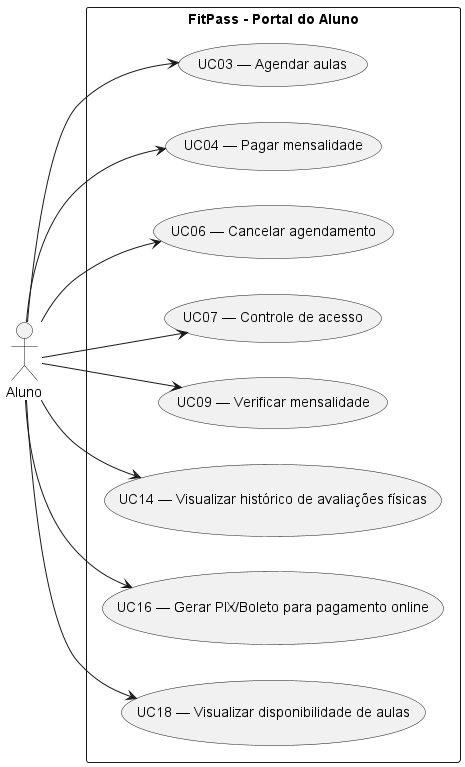

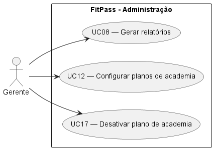

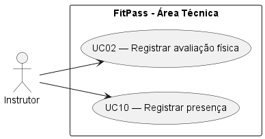

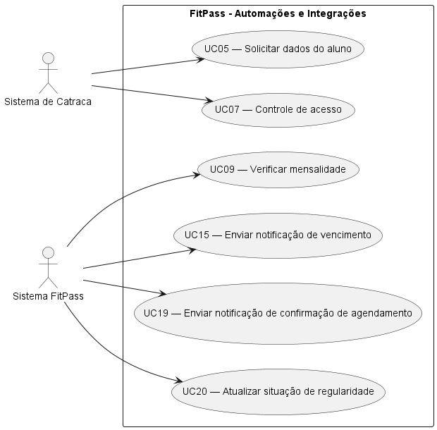

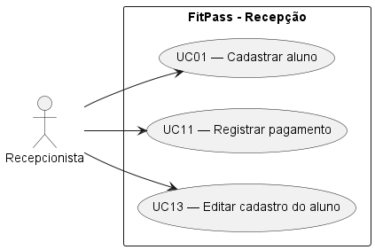

## UC01 — Cadastrar aluno
### Ator Principal
Recepcionista

### Objetivo
Realizar o cadastro do aluno no sistema

### Pré-condições
- Nenhuma

### Pós-condições
- Aluno cadastrado

### Fluxo Principal
1. Usuário insere dados do aluno e envia
2. Sistema processa solicitação
3. Sistema cadastra aluno no banco
4. Sistema retorna mensagem de sucesso

### Fluxos Alternativos
- **A1 — Dados incompletos:**
1. Sistema retorna mensagem de erro
2. Sistema rejeita solicitação

### RF Relacionados
- RF01 - Cadastro de alunos

### RNF Relacionados
- RNF02 - Segurança

### RN Relacionadas
- RN06 - Acesso restrito por perfil

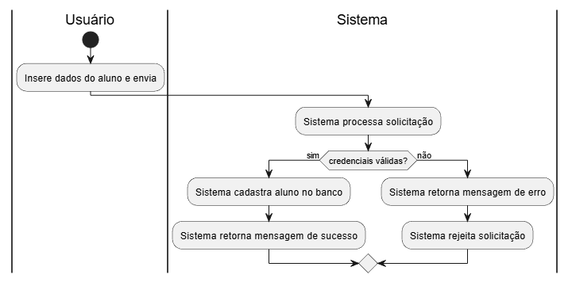
---

## UC02 — Registrar avaliação física

### Ator Principal
Instrutor

### Objetivo
Registrar uma avaliação física de um aluno

### Pré-condições
- Aluno cadastrado

### Pós-condições
- Avaliação física registrada

### Fluxo Principal
1. Instrutor cria uma avaliação física e envia ao sistema
2. Sistema processa a solicitação
3. Sistema registra avaliação
4. Sistema notifica aluno
5. Sistema retorna mensagem de sucesso

### Fluxos Alternativos
- **A1 — Aluno inativo:**
1. Sistema notifica a situação do aluno ao instrutor
2. Sistema cancela a operação com mensagem de erro

### RF Relacionados
- RF08 - Avaliação Física
- RF10 - Notificações

### RNF Relacionados
- RNF03 - Performance
- RNF04 - Usabilidade
- RNF05 - Escalabilidade

### RN Relacionadas
- RN05 - Avaliação física
- RN06 - Acesso restrito por perfil

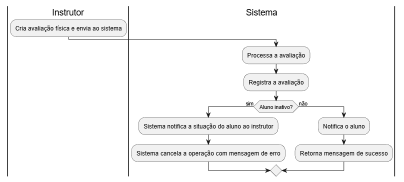
---

## UC03 — Agendar aulas

### Ator Principal
Aluno

### Objetivo
Agendar uma aula

### Pré-condições
- Aluno cadastrado

### Pós-condições
- Aula agendada

### Fluxo Principal
1. Aluno solicita um agendamento ao sistema
2. Sistema processa a solicitação
3. Sistema confirma o agendamento
4. Sistema retorna mensagem de sucesso

### Fluxos Alternativos
- **A1 — Aula lotada:**
1. Sistema retorna mensagem de erro
2. Sistema rejeita a solicitação

### RF Relacionados
- RF06 - Agendamento de aulas

### RNF Relacionados
- RNF03 - Performance
- RNF04 - Escalabilidade

### RN Relacionadas
- RN02 - Limite de vagas

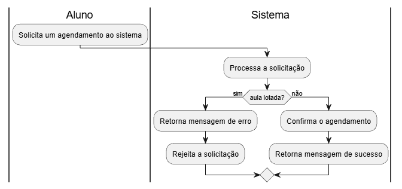
---

## UC04 — Pagar mensalidade

### Ator Principal
Aluno

### Objetivo
Realizar o pagamento da mensalidade

### Pré-condições
- Aluno cadastrado

### Pós-condições
- Mensalidade paga
- Acesso à academia renovado

### Fluxo Principal
1. Aluno requisita pagamento
2. Sistema processa pagamento
3. Sistema renova status do aluno
4. Sistema retorna mensagem de sucesso

### Fluxos Alternativos
- **A1 — Valor insuficiente:**
1. Sistema retorna mensagem de erro
2. Sistema rejeita solicitação

### RF Relacionados
- RF03 - Controle de pagamentos

### RNF Relacionados
- RNF02 - Segurança

### RN Relacionadas
- RN04 - Pagamento parcial
- RN07 - Atualização automática da regularidade

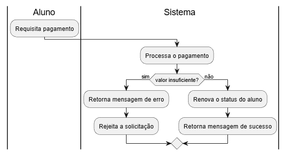
---

## UC05 — Solicitar dados do aluno

### Ator Principal
Sistema de Catraca

### Objetivo
Verificar conformidade do aluno

### Pré-condições
- Aluno cadastrado

### Pós-condições
- Catraca liberada
- Catraca bloqueada

### Fluxo Principal
1. Sistema de Catraca recebe identificação do aluno
2. Sistema de Catraca solicita dados ao sistema principal pela identificação
3. Sistema de Catraca recebe os dados
4. Sistema de Catraca realiza verificação para controle de acesso

### Fluxos Alternativos
- **A1 — Formato de resposta desconhecido:**
1. Sistema de Catraca não consegue ler os dados
2. Sistema de Catraca retorna mensagem de erro
3. Sistema de Catraca descarta dados

- **A2 — Identificação não encontrada:**
1. Sistema de Catraca retorna um aviso

### RF Relacionados
- RF05 - Controle de acesso

### RNF Relacionados
- RNF06 - Integração

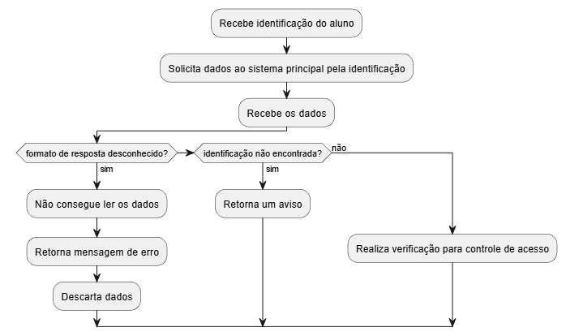
---

## UC06 — Cancelar agendamento

### Ator Principal
Aluno

### Objetivo
Permitir que o usuário cancele o agendamento de aulas

### Pré-condições
- Usuário aluno deve já ter feito o agendamento de alguma aula

### Pós-condições
- Agendamento cancelado com sucesso

### Fluxo Principal
1. O usuário aluno cancela o agendamento
2. O sistema verifica se falta mais de 1 hora para o começo da aula
3. O sistema confirma o cancelamento

### Fluxos Alternativos
- **A1 — Menos de 1 hora para começar a aula:**
  
  O sistema não permite o cancelamento

### RN Relacionados
- RN03

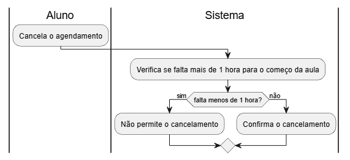
---

## UC07 — Controle de Acesso

### Ator Principal
- Catraca
- Aluno

### Objetivo
Validar a entrada do aluno por RFID

### Pré-condições
- O usuário aluno deve possuir um cadastro ativo
- O usuário aluno não deve possuir as mensalidades vencidas há mais de 5 dias

### Pós-condições
- Entrada de usuário aluno validada com sucesso

### Fluxo Principal
1. O usuário aluno utiliza a catraca
2. O sistema da catraca verifica se as mensalidades não estão vencidas há mais de 5 dias
3. O sistema da catraca permite a entrada do usuário aluno

## Fluxos Alternativos
- **A1 — Bloqueio por Inadimplência:**
  
  O sistema não permite a entrada do usuário aluno

## RF Relacionados
- RF03
  
## RN Relacionados
- RN01

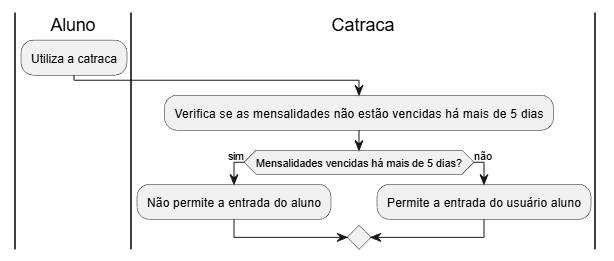
---

## UC08 — Gerar relatórios

### Ator Principal
Gerente

### Objetivo
Permitir que o gerente extraia informações consolidadas sobre inadimplência, alunos ativos, histórico de acessos e ocupação das aulas para apoiar a tomada de decisão.

### Pré-condições
- O gerente deve estar autenticado no sistema.
- O sistema deve conter dados suficientes registrados (cadastros, acessos, pagamentos).

### Pós-condições
- Relatório gerado e exibido em tela, com a possibilidade de ser exportado.

### Fluxo Principal
1. O gerente acessa o módulo de "Relatórios" no menu principal.
2. O gerente seleciona o tipo de relatório desejado (ex: Inadimplência, Alunos Ativos, Histórico de Acessos ou Ocupação das Aulas).
3. O gerente define os filtros necessários (período de datas, modalidade, status) e clica em "Gerar Relatório".
4. O sistema processa as informações do banco de dados.
5. O sistema exibe o resultado formatado em tela.
6. O gerente clica na opção de exportar (PDF ou planilhas) e salva o documento.

### Fluxos Alternativos
- **A1 — Nenhum dado encontrado:**
1. O gerente define os filtros e clica em "Gerar Relatório".
2. O sistema verifica que não existem registros para os critérios selecionados.
3. O sistema exibe a mensagem "Nenhum dado encontrado para os filtros informados" e retorna à tela de seleção.

### RF Relacionados
- RF09 — Relatórios Gerenciais

### RNF Relacionados
- RNF03 — Performance
- RNF04 — Usabilidade

### RN Relacionadas
- RN06 — Acesso restrito por perfil

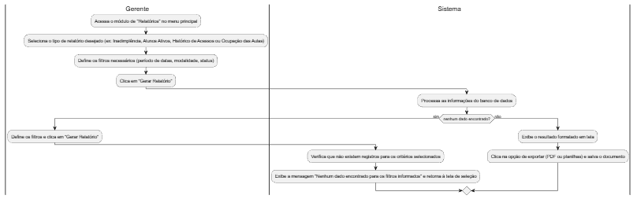
---

## UC09 — Verificar mensalidade

### Ator Principal
- Sistema
- Aluno

### Objetivo
Verificar se a mensalidade do usuário aluno está em dia

### Pré-condições
- O usuário aluno deve estar cadastrado no sistema
- O usuário aluno deve ter um plano ativo

### Pós-condições
- Verificação de mensalidade bem-sucedida

### Fluxo Principal
1. O sistema faz uma requisição pela API REST para retornar do JSON o status atual da última mensalidade do aluno
2. O sistema determina se a mensalidade está em dia ou não

### Fluxo Alternativo
- **A1 — Mensalidade atrasada em até 5 dias:**
  
  O sistema determina que a mensalidade não está em dia
  
- **A2 — Mensalidade atrasada há mais de 5 dias:**
  
  1. O sistema determina que a mensalidade não está em dia
  2. O sistema bloqueia a entrada do usuário aluno por inadimplência
  
- **A3 — Mensalidade dentro do prazo:**
  
  O sistema determina que a mensalidade está em dia

### RF Relacionados
- RF04

### RN Relacionados
- RN01

### RNF Relacionados
- RNF06

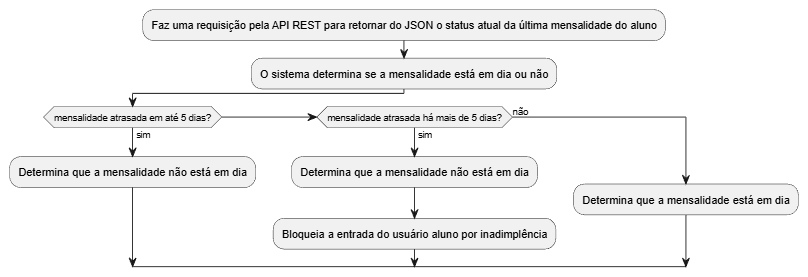
---

## UC10 — Registrar presença

### Ator Principal
Instrutor

### Objetivo
Permitir que o instrutor confirme a presença dos alunos que agendaram e compareceram a uma aula específica.

### Pré-condições
- O instrutor deve estar logado no sistema.
- A aula deve existir no quadro de horários e possuir alunos com agendamento prévio.

### Pós-condições
- A lista de presença da aula é atualizada e salva no banco de dados.

### Fluxo Principal
1. O instrutor acessa a seção "Minhas Aulas" e seleciona a aula atual do dia.
2. O sistema exibe a lista de todos os alunos que agendaram a referida aula.
3. O instrutor realiza a chamada ou conferência visual.
4. O instrutor marca o status (Presente/Ausente) para cada aluno listado.
5. O instrutor clica em "Salvar Presenças".
6. O sistema atualiza o histórico dos alunos e exibe uma mensagem de sucesso.

### Fluxos Alternativos
- **A1 — Adicionar aluno não agendado (encaixe):**
1. Um aluno comparece à aula sem ter feito o agendamento prévio pelo aplicativo.
2. O instrutor clica na opção "Adicionar aluno" na tela da lista de presença.
3. O instrutor busca o aluno pelo nome ou CPF.
4. O sistema valida se a aula ainda possui vagas (RN02) e se o aluno está regular (RN01).
5. Estando tudo certo, o sistema inclui o aluno na lista da aula.
6. O fluxo retorna ao passo 4 do fluxo principal.

### RF Relacionados
- RF07 — Lista de Presença
- RF06 — Agendamento de Aulas

### RNF Relacionados
- RNF04 — Usabilidade

### RN Relacionadas
- RN01 — Bloqueio por inadimplência
- RN02 — Limite de vagas
- RN06 — Acesso restrito por perfil

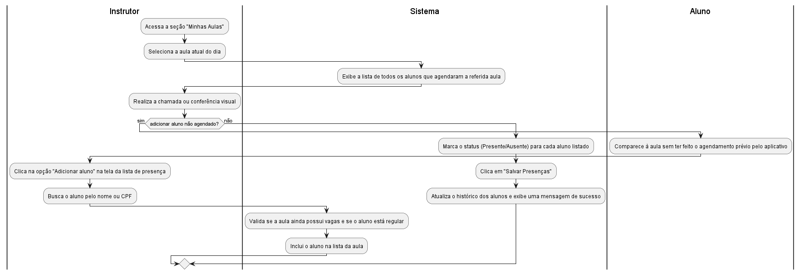
---

## UC11 — Registrar Pagamento

### Ator Principal
Recepcionista

### Objetivo
Registrar a quitação de uma mensalidade para regularizar a situação do aluno.

### Pré-condições
Aluno deve estar previamente cadastrado.

### Pós-condições
Status de regularidade do aluno atualizado para "Em dia" imediatamente (RN07).

### Fluxo Principal
- O recepcionista seleciona o aluno e a fatura pendente.
- O recepcionista informa a forma de pagamento (Dinheiro, Cartão ou PIX) (RF03).
- O sistema valida o valor integral do pagamento (RN04).
- O sistema registra o pagamento e atualiza automaticamente a situação do aluno para "Regular".

### Fluxos Alternativos
- **A1 — Tentativa de pagamento parcial:**
O sistema bloqueia a operação e informa que pagamentos parciais não são permitidos (RN04).

### RF / RN Relacionados
RF03, RN04, RN07.

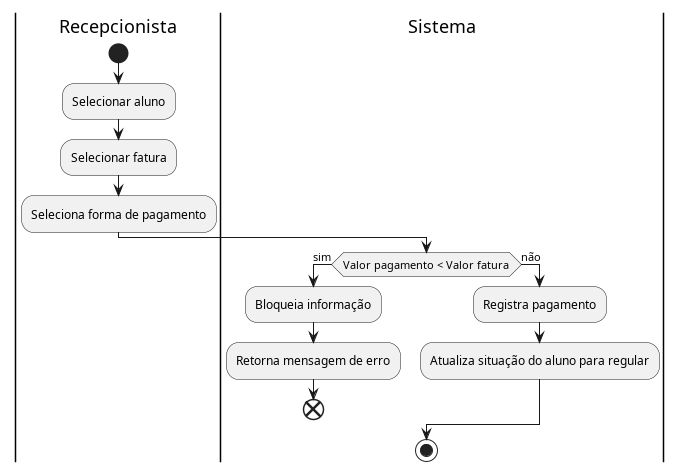
---

## UC12 — Configurar Planos da Academia

### Ator Principal
- Gerente

### Objetivo
- Criar ou editar as modalidades e pacotes oferecidos pela academia.

### Pré-condições
- O usuário deve possuir perfil de Gerente (RN06).

### Pós-condições
- Novo plano disponível para venda na recepção.

### Fluxo Principal
1. O gerente acessa o gerenciamento de planos (RF02).
2. O gerente define o nome (ex: "Plano Funcional"), valor, periodicidade e status.
3. O sistema salva as configurações.

### Fluxos Alternativos
- **A1 — Desativação de plano:**
  
  O gerente desativa um plano existente; novos alunos não podem mais contratá-lo, mas alunos antigos mantêm o contrato até o fim da vigência.

### RF Relacionados
- RF02

### RN Relacionaods
- RN06

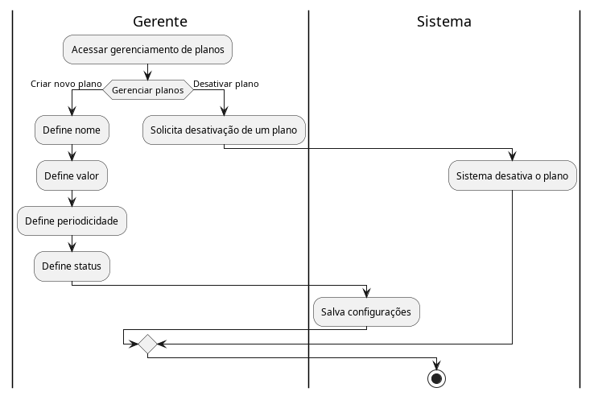
---

## UC13 — Editar cadastro do aluno

### Ator Principal
Recepcionista

### Objetivo
Atualizar as informações pessoais, de contato ou o endereço de um aluno previamente cadastrado no sistema.

### Pré-condições
- O aluno deve possuir um cadastro prévio no sistema.
- A recepcionista deve estar autenticada no sistema.

### Pós-condições
- Os dados do aluno são atualizados no banco de dados.

### Fluxo Principal
1. A recepcionista busca o aluno pelo CPF ou nome.
2. O sistema retorna o cadastro atual do aluno.
3. A recepcionista clica na opção de editar os dados.
4. A recepcionista insere as novas informações (ex: novo telefone, novo endereço) e envia.
5. O sistema valida e salva as alterações.
6. O sistema exibe uma mensagem de sucesso.

### Fluxos Alternativos
- **A1 — Aluno não encontrado:**
1. A recepcionista informa o CPF/nome.
2. O sistema não localiza o aluno e exibe uma mensagem de erro ("Cadastro não encontrado").
3. O fluxo é encerrado ou retorna ao passo 1.

### RF Relacionados
- RF01 — Cadastro de Alunos

### RNF Relacionados
- RNF02 — Segurança
- RNF04 — Usabilidade

### RN Relacionadas
- RN06 — Acesso restrito por perfil

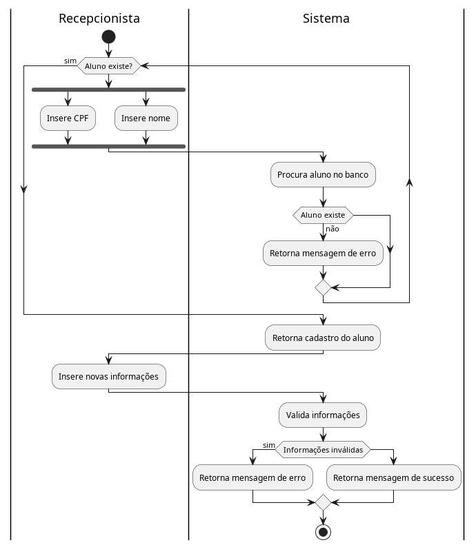
---

## UC14 — Visualizar histórico de avaliações físicas

### Ator Principal
Aluno

### Objetivo
Permitir que o aluno consulte os resultados e anexos de todas as avaliações físicas já realizadas pelos instrutores.

### Pré-condições
- O aluno deve estar autenticado no aplicativo ou portal web.
- O aluno deve possuir ao menos uma avaliação física registrada.

### Pós-condições
- Nenhuma modificação no sistema (apenas visualização).

### Fluxo Principal
1. O aluno acessa a aba "Minhas Avaliações".
2. O sistema busca no banco de dados o histórico do aluno.
3. O sistema exibe uma lista com as datas de todas as avaliações realizadas.
4. O aluno seleciona uma avaliação específica.
5. O sistema exibe os detalhes (peso, IMC, percentual de gordura) e permite baixar anexos, se houver.

### Fluxos Alternativos
- **A1 — Nenhuma avaliação cadastrada:**
1. O aluno acessa a aba "Minhas Avaliações".
2. O sistema identifica que não há registros e exibe a mensagem "Nenhuma avaliação física encontrada".

### RF Relacionados
- RF08 — Avaliação Física

### RNF Relacionados
- RNF02 — Segurança
- RNF04 — Usabilidade

### RN Relacionadas
- Nenhuma

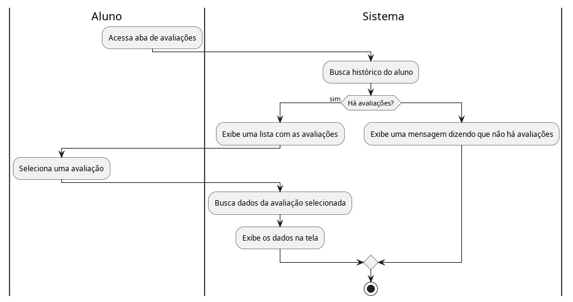
---

## UC15 — Enviar notificação de vencimento de mensalidade

### Ator Principal
Sistema

### Objetivo
Alertar o aluno automaticamente sobre o vencimento próximo ou ocorrido de sua mensalidade.

### Pré-condições
- O aluno deve ter um plano ativo.
- A data atual deve coincidir com a regra de notificação (ex: 3 dias antes do vencimento ou no dia exato).

### Pós-condições
- Notificação disparada e registrada no histórico do aluno.

### Fluxo Principal
1. O sistema realiza uma varredura diária nas mensalidades.
2. O sistema identifica uma mensalidade próxima ao vencimento ou recém-vencida.
3. O sistema gera a mensagem de aviso padronizada.
4. O sistema envia a notificação via aplicativo ou e-mail cadastrado.
5. O sistema registra que o aviso foi enviado.

### Fluxos Alternativos
- **A1 — Falha no envio:**
1. O sistema tenta enviar a notificação e o serviço de e-mail/push falha.
2. O sistema enfileira a mensagem para uma nova tentativa nas próximas horas.

### RF Relacionados
- RF10 — Notificações
- RF04 — Regularidade do Aluno

### RNF Relacionados
- RNF01 — Disponibilidade

### RN Relacionadas
- RN01 — Bloqueio por inadimplência

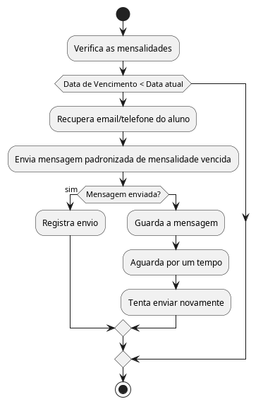
---

## UC16 — Gerar PIX/Boleto para pagamento online

### Ator Principal
Aluno

### Objetivo
Permitir a emissão de código PIX ou boleto para que o aluno quite sua mensalidade de forma remota.

### Pré-condições
- O aluno deve estar logado no aplicativo ou portal.
- O aluno deve possuir uma mensalidade em aberto (pendente).

### Pós-condições
- Código PIX ou linha digitável do boleto disponibilizados na tela.

### Fluxo Principal
1. O aluno navega até a seção "Financeiro" e seleciona a mensalidade pendente.
2. O aluno escolhe a opção de pagamento (Boleto ou PIX).
3. O sistema processa o pedido e, se necessário, integra-se ao gateway de pagamento.
4. O sistema gera e exibe o código na tela com opção de "Copiar código".

### Fluxos Alternativos
- **A1 — Sistema de pagamento offline:**
1. O sistema tenta gerar o PIX/Boleto, mas o gateway está indisponível.
2. O sistema exibe mensagem de erro orientando o aluno a tentar novamente mais tarde.

### RF Relacionados
- RF03 — Controle de Pagamentos

### RNF Relacionados
- RNF01 — Disponibilidade
- RNF02 — Segurança

### RN Relacionadas
- RN04 — Pagamento parcial (o sistema deve gerar o valor integral)

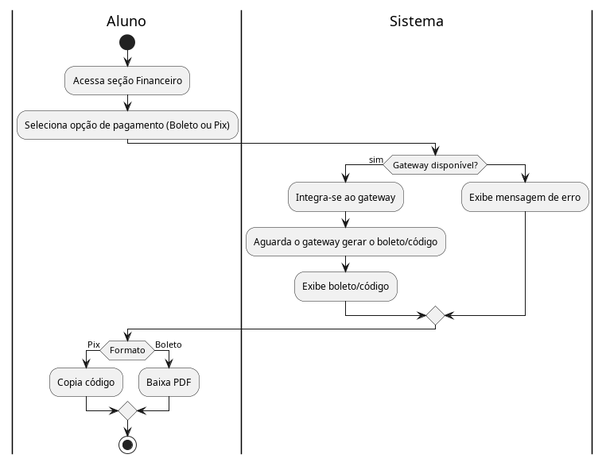
---

## UC17 — Desativar plano de academia

### Ator Principal
Gerente

### Objetivo
Remover um plano do catálogo de vendas, impedindo que novas matrículas sejam feitas com ele.

### Pré-condições
- O gerente deve estar autenticado.
- O plano escolhido deve estar com o status "Ativo".

### Pós-condições
- O plano tem seu status alterado para "Inativo".

### Fluxo Principal
1. O gerente acessa o menu de "Configuração de Planos".
2. O sistema lista todos os planos existentes.
3. O gerente seleciona um plano ativo e clica em "Desativar".
4. O sistema solicita uma confirmação da ação.
5. O gerente confirma.
6. O sistema altera o status do plano e salva as alterações.

### Fluxos Alternativos
- **A1 — Alunos vinculados ao plano desativado:**
1. O gerente desativa o plano.
2. O sistema desativa para novas vendas, mas mantém o plano funcional e visível apenas para os alunos que já o possuem, até o fim da vigência dos mesmos.

### RF Relacionados
- RF02 — Gerenciamento de Planos

### RNF Relacionados
- RNF04 — Usabilidade

### RN Relacionadas
- RN06 — Acesso restrito por perfil

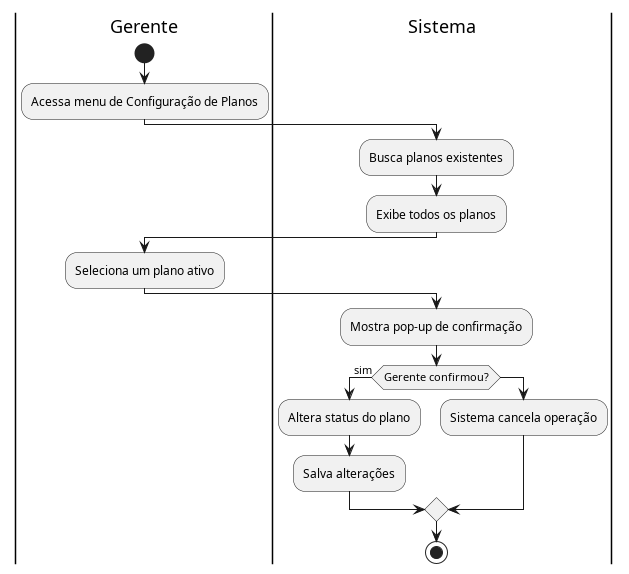
---

## UC18 — Visualizar disponibilidade de aulas

### Ator Principal
Aluno

### Objetivo
Permitir que o aluno confira o quadro de horários, a grade de aulas disponíveis e o número de vagas antes de realizar o agendamento.

### Pré-condições
- O aluno deve estar autenticado.

### Pós-condições
- Grade de horários atualizada é exibida.

### Fluxo Principal
1. O aluno acessa a seção de "Aulas e Agendamentos".
2. O aluno seleciona a data ou semana desejada.
3. O sistema processa as aulas cadastradas para aquele período.
4. O sistema calcula a disponibilidade atual (vagas totais menos vagas reservadas).
5. O sistema exibe o quadro de horários com as aulas, instrutores e o aviso de lotação (se houver).

### Fluxos Alternativos
- **A1 — Aula com limite atingido:**
1. Durante o passo 4, o sistema detecta que uma aula atingiu o número máximo de inscritos.
2. No passo 5, o sistema exibe a aula com a marcação "Esgotado", desativando o botão de reserva.

### RF Relacionados
- RF06 — Agendamento de Aulas

### RNF Relacionados
- RNF03 — Performance
- RNF04 — Usabilidade

### RN Relacionadas
- RN02 — Limite de vagas

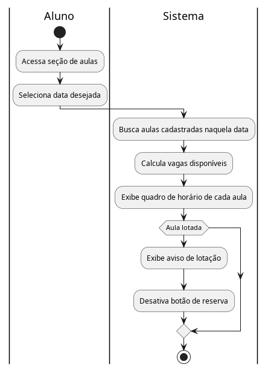
---

## UC19 — Enviar notificação de confirmação de agendamento

### Ator Principal
Sistema

### Objetivo
Informar ao aluno que sua vaga na aula desejada foi reservada (ou cancelada) com sucesso.

### Pré-condições
- O aluno (ou o instrutor/sistema) completou a ação de agendamento ou cancelamento de aula.

### Pós-condições
- Mensagem de confirmação enviada ao dispositivo do aluno.

### Fluxo Principal
1. O caso de uso "Agendar aulas" ou "Cancelar agendamento" é finalizado com sucesso.
2. O sistema monta a notificação com os dados da aula (nome, data, horário, instrutor).
3. O sistema dispara a notificação push/e-mail para o aluno.
4. O sistema registra o envio no histórico.

### Fluxos Alternativos
- **A1 — Preferências de notificação desativadas:**
1. O aluno optou por não receber notificações no aplicativo.
2. O sistema registra internamente o sucesso da reserva, mas não dispara o push.

### RF Relacionados
- RF10 — Notificações

### RNF Relacionados
- RNF01 — Disponibilidade

### RN Relacionadas
- Nenhuma específica

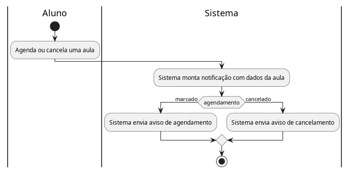
---

## UC20 — Atualizar situação de regularidade do aluno

### Ator Principal
Sistema

### Objetivo
Verificar os pagamentos e alterar o status do aluno automaticamente para liberar ou bloquear o seu acesso à academia.

### Pré-condições
- Um pagamento deve ser registrado na recepção ou via gateway online.

### Pós-condições
- A regularidade do aluno é atualizada para "Regular" (ou "Inadimplente", se o pagamento estornar).
- A permissão de acesso via catraca é atualizada.

### Fluxo Principal
1. O sistema é notificado de que um pagamento foi realizado e aprovado.
2. O sistema identifica a qual aluno e mensalidade o pagamento se refere.
3. O sistema baixa a pendência financeira (marca a parcela como "paga").
4. O sistema atualiza o status de regularidade do aluno para "Regular".
5. O sistema atualiza a base da catraca (ou se prepara para responder "Autorizado" quando a catraca solicitar os dados).

### Fluxos Alternativos
- **A1 — Pagamento não compensado:**
1. O aluno gera o boleto, mas o banco não envia a compensação (ou o pagamento via cartão é estornado).
2. O sistema mantém o aluno como "Inadimplente" ou, se já regularizado temporariamente, reverte o status após confirmação da falha.

### RF Relacionados
- RF04 — Regularidade do Aluno

### RNF Relacionados
- RNF03 — Performance
- RNF06 — Integração

### RN Relacionadas
- RN01 — Bloqueio por inadimplência
- RN07 — Atualização automática da regularidade

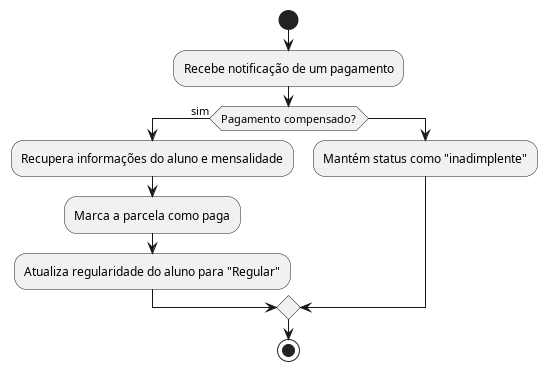